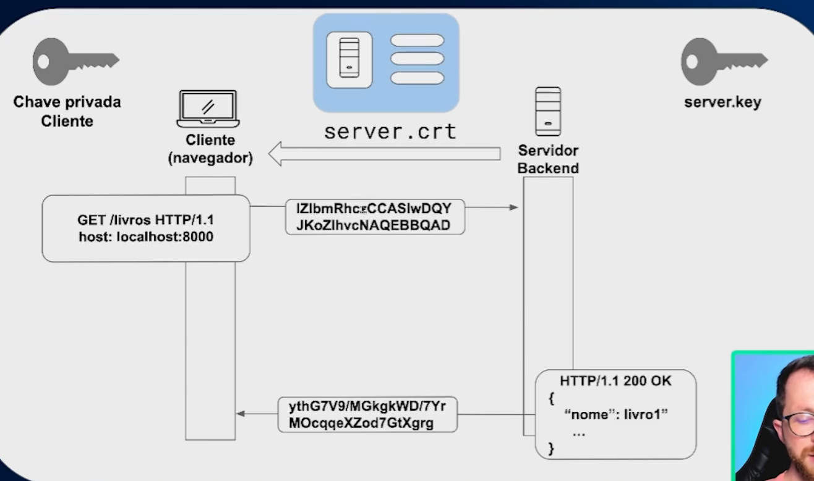

## Como funciona a arquitetura quando temos certificado https?

Basicamente, agora o servidor tem uma chave privada, e ele manda esse certificado para o cliente, para o cliente validar se o servidor é quem ele realmente diz que é, e o cliente também vai ter uma chave privada que é usada para criptografar os dados. ( ele gera uma chave privada diferente para cada conexao )

em resumo agora:
  - O cliente faz a requisição, os dados são enviados criptografados, o servidor recebe essa requisição descriptografa processa e devolve uma resposta  também criptografada.