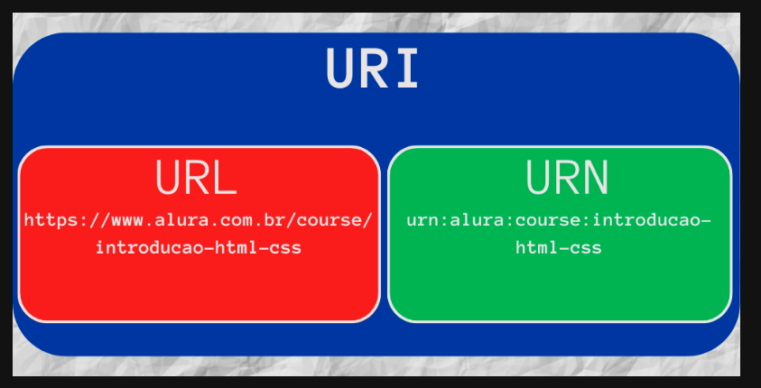

## Diferença entre URL e URI

Uma URL é uma URI, mas nem todas as URI's são URL's! Existem URI's que identificam um recurso sem definir o endereço, nem o protocolo. Em outras palavras, uma URL representa uma identificação de um recurso (URI) através do endereço, mas nem todas as identificações são URL's.

