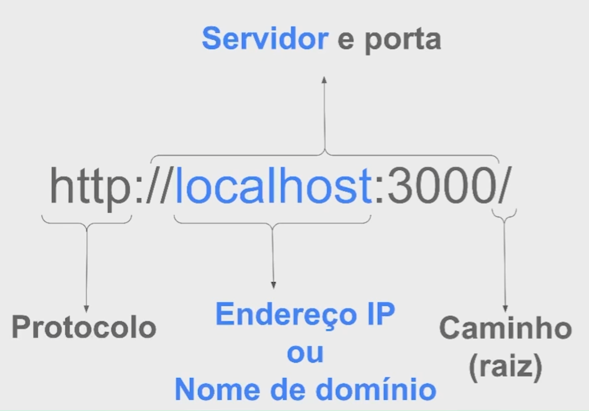

## Estrutura de uma url explicada

1. primeiro temos o tipo de protocolo que estamos utilizando **http**
2. temos nosso servidor e/ou nosso nome de dominio (google.com) / ip **localhost**
3. temos a porta para acesso ao servidor **3000**
4. temos o caminho raiz, onde todo o conteudo está
