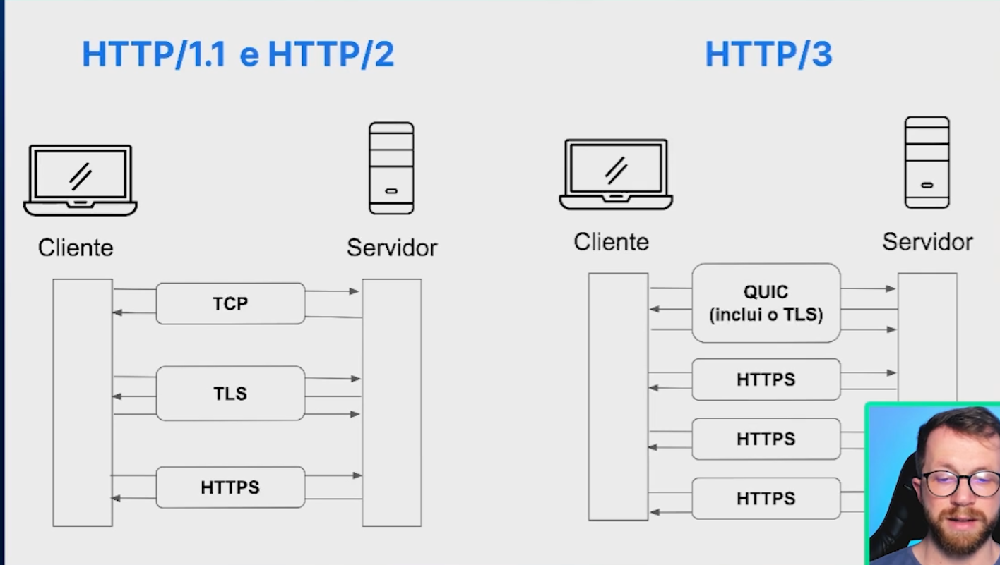

## O Que É HTTP/3?

HTTP/3 é a próxima evolução do HTTP, projetado para ser mais rápido e eficiente. Ele utiliza o protocolo **QUIC**, que funciona sobre **UDP** em vez de **TCP**. As principais vantagens incluem:

- **Menor Latência**: QUIC evita o processo de handshake lento do TCP, tornando as conexões mais rápidas.
- **Reconexões Mais Eficientes**: Em caso de mudança de rede ou perda de pacote, o QUIC consegue restabelecer conexões mais rapidamente, o que é útil para dispositivos móveis.
- **Multiplexação Sem Head-of-Line Blocking**: Assim como o HTTP/2, permite múltiplas solicitações simultâneas, mas evita bloqueios quando ocorre perda de pacotes.

## A Comparação entre HTTP/1.1, HTTP/2 e HTTP/3

A imagem compara as diferenças entre os protocolos **HTTP/1.1 e HTTP/2** (à esquerda) e **HTTP/3** (à direita), destacando as camadas e protocolos envolvidos em cada versão.

### HTTP/1.1 e HTTP/2 (à esquerda)
- **TCP**: Os protocolos HTTP/1.1 e HTTP/2 usam o **TCP** (Transmission Control Protocol) para transmitir dados entre o cliente e o servidor. O TCP é um protocolo de transporte que garante a entrega ordenada e confiável dos pacotes.
- **TLS**: Em seguida, o **TLS** (Transport Layer Security) é usado para criptografar a comunicação, garantindo a segurança dos dados. Isso é necessário para HTTP seguro (HTTPS).
- **HTTPS**: Finalmente, o HTTP/1.1 e o HTTP/2 usam HTTPS para comunicação segura, que está sobre o TCP e o TLS.

### HTTP/3 (à direita)
- **QUIC (inclui TLS)**: No HTTP/3, o protocolo **QUIC** substitui o TCP. O QUIC é um protocolo de transporte que opera sobre **UDP** e tem o TLS integrado. Isso elimina a necessidade de uma camada TLS separada, como no HTTP/1.1 e HTTP/2. O QUIC é projetado para ser mais rápido e eficiente, especialmente para conexões instáveis, porque evita o handshake lento do TCP e permite reconexões rápidas.
- **HTTPS**: Assim como nos protocolos anteriores, o HTTP/3 utiliza HTTPS para a comunicação segura. No entanto, o QUIC já inclui o TLS, o que simplifica o processo de criptografia e melhora a velocidade da conexão.

### Resumo
A principal diferença visualizada na imagem é que o HTTP/3 simplifica o fluxo de comunicação, eliminando a camada separada do TCP e do TLS ao incorporar essas funcionalidades diretamente no QUIC. Isso permite conexões mais rápidas e eficientes, aproveitando os benefícios do UDP para reduzir a latência e melhorar o desempenho, especialmente em redes móveis ou instáveis.
