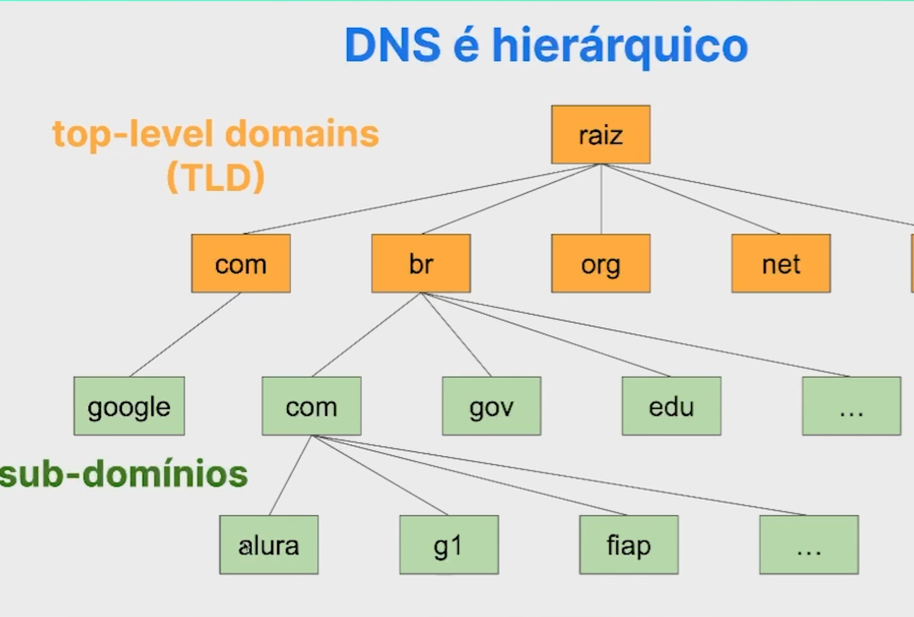

## DNS ( Sistema de Nomes de Dominios )

> O DNS tem como função realizar a tradução do nome de um domínio para o endereço de IP correspondente.

Todo computador precisa de um endereço de ip para se conectar a internet, o `DNS` veio para nomear os ips, para facilitar a procura pelos sites, imagina vc ter que decorar 142.251.128.14 para acessar o google 

> para saber oq é um domínio acesse o arquivo `o-que-e-dominio.md`

## DNS EM DETALHE

### imagina quando tempo levaria para acessar todos os sites do mundo?

foi então que criaram um metodo, para otimizar o acesso aos dominios, sendo .com , .br,.org,.net e etc os `top level`
e alura, google, g1 os `sub-dominios`

