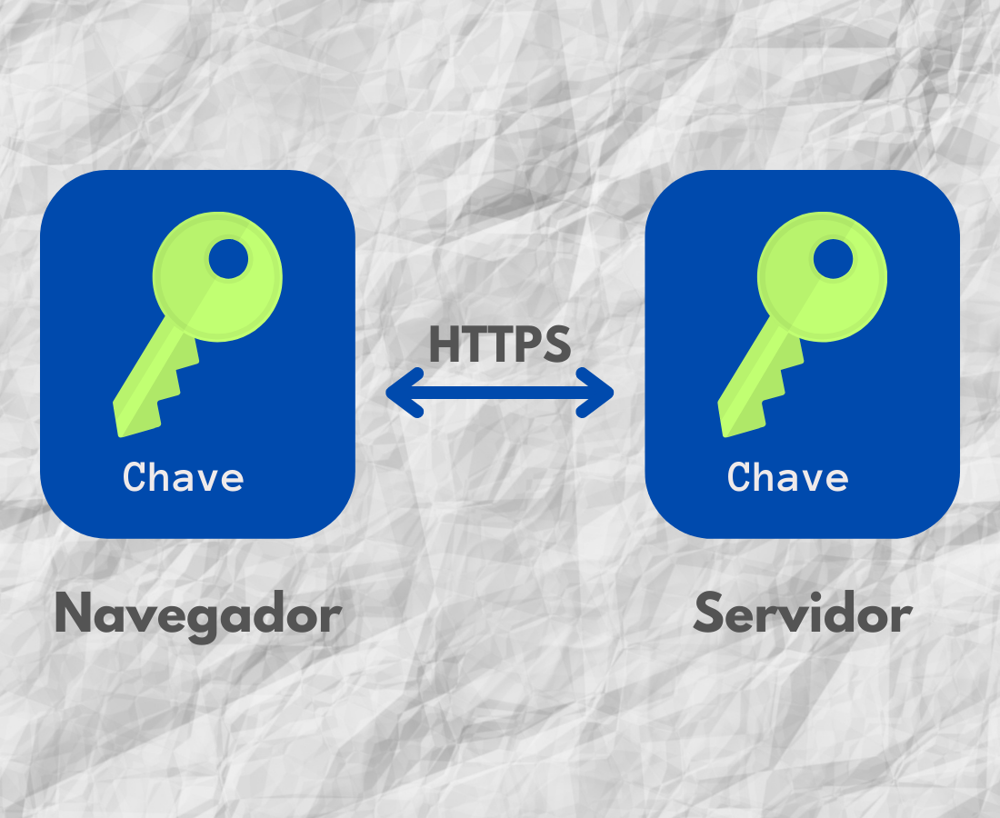

Aprendemos no vídeo que o HTTPS usa uma chave pública e uma chave privada. As chaves estão ligadas matematicamente, o que foi cifrado pela chave pública só pode ser decifrado pela chave privada. Isso garante que os dados cifrados pelo navegador (chave pública) só podem ser lidos pelo servidor (chave privada). Como temos duas chaves diferentes envolvidas, esse método de criptografia é chamado de criptografia assimétrica. No entanto, a criptografia assimétrica tem um problema, ela é lenta.

alt: Diagrama horizontal com duas partes, da esquerda para a direita: um quadro azul com um ícone de chave amarela com o nome “chave pública” que é indicada no navegador e, ao lado, outro quadro em azul com um ícone de chave branca com o nome “chave privada” que é indicada no servidor.

Por outro lado, temos a criptografia simétrica, que usa a mesma chave para cifrar e decifrar os dados, como na vida real, onde usamos a mesma chave para abrir e fechar a porta. A criptografia simétrica é muito mais rápida.

alt: Diagrama horizontal com duas partes, da esquerda para a direita: um quadro azul com um ícone de chave verde com o nome “chave” que é indicada no navegador e, ao lado, outro quadro em azul com um ícone de chave verde com o nome “chave” que é indicada no servidor.

Agora, o interessante é que o HTTPS usa ambos os métodos de criptografia, assimétrica e simétrica. Como assim? Muita calma, tudo o que aprendemos é verdade! Só faltou o grande final :)

No certificado, vem a chave pública para o cliente utilizar, certo? E o servidor continua na posse da chave privada, ok? Isso é seguro, mas lento e por isso o cliente gera uma chave simétrica ao vivo. Uma chave só para ele e o servidor com o qual está se comunicando naquele momento! Essa chave exclusiva (e simétrica) é então enviada para o servidor utilizando a criptografia assimétrica (chave privada e pública) e então é utilizada para o restante da comunicação.

Então, HTTPS começa com criptografia assimétrica para depois mudar para criptografia simétrica. Essa chave simétrica será gerada no início da comunicação e será reaproveitada nas requisições seguintes. Bem-vindo ao mundo fantástico do HTTPS :)