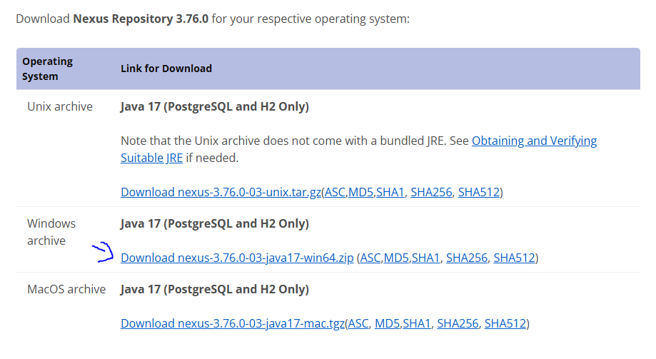
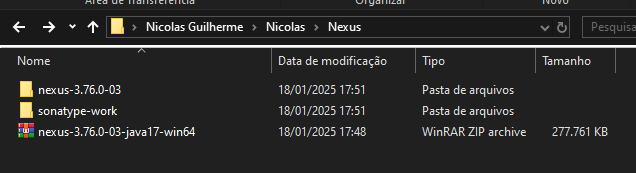
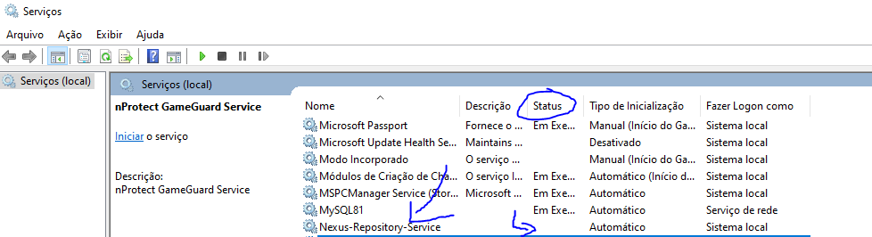

> Link tutorial: https://www.youtube.com/watch?v=TRI-GfkCNeE

# Como rodar o nexus no windows de forma rapida SEM SERVICE?

  
Como rodar o nexus no windows de forma rapida SEM SERVICE?

  1. instale o nexus no windows, link: https://help.sonatype.com/en/download.html
      

        
imagem

        
      

  2. após baixar descompacte ele em uma pasta isolada de preferencia, no meu caso foi dentro de `C:\Users\nicol\Nicolas\Nexus`
      

        
imagem

        
        
      

  3. abra o CMD (windows) e vá para a rota `C:\Users\nicol\Nicolas\Nexus`
  4. rode o commando `cd nexus-3.76.0-03/bin`
  5. dentro do bin se vc der um dir vc vai ver que tem um nexus.exe
  6. rode o comando `nexus.exe /run`
  7. o nexus irá rodar localmente na porta http://localhost:8081

  
Como rodar o nexus no windows COM SERVICE?

  1. instale o nexus no windows, link: https://help.sonatype.com/en/download.html
      

        
imagem

        
      

  2. após baixar descompacte ele em uma pasta isolada de preferencia, no meu caso foi dentro de `C:\Users\nicol\Nicolas\Nexus`
      

        
imagem

        
        
      

  3. abra o CMD (windows) `COMO ADMINISTRADOR` e vá para a rota `C:\Users\nicol\Nicolas\Nexus`
  4. rode o commando `cd nexus-3.76.0-03/bin`
  5. dentro do bin se vc der um dir vc vai ver que tem um nexus.exe
  6. rode o comando `nexus.exe /install Nexus-Repository-Service`
  7. isso vai fazer com que instale um serviço no windows chamado `Nexus-Repository-Service`
  8. se você ir na barra de pesquisa do windows e digitar `Serviços` e entrar nele, voce vai conseguir ver o serviço
      

        
imagem

        
        
      

  9. para iniciar o serviço rode o comando `nexus.exe /start   Nexus-Repository-Service`
  10. apos alguns instantes ele estara disponivel na porta `http://localhost:8081/`

