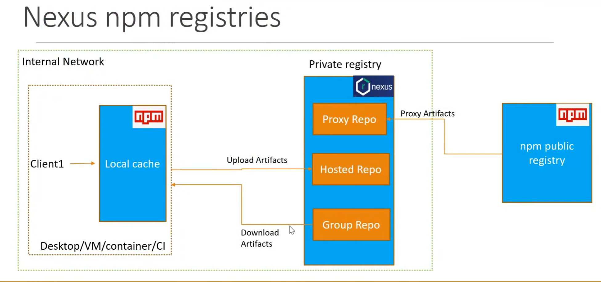

# Como funciona a arquitetura do nexus?

## Explicação

# Arquitetura: Nexus NPM Registries

A imagem representa a arquitetura de **Nexus NPM Registries**, mostrando como funciona a interação entre um registro privado de NPM no Nexus e um cliente.

---

## Estrutura da Arquitetura

### 1. **Internal Network**
   - A rede interna é onde o cliente (Client1) se comunica com o registro privado (Nexus).
   - Inclui dispositivos como **Desktop**, **VM**, **container**, ou sistemas de integração contínua (**CI**).

### 2. **Client1**
   - Representa o cliente que utiliza o `npm` para consumir pacotes.
   - O cliente mantém um **Local Cache** dos pacotes instalados, para evitar downloads repetidos.

### 3. **Private Registry (Nexus)**
   - O Nexus atua como um registro privado de NPM e gerencia três tipos de repositórios:
     - **Proxy Repo**: Repositório proxy que se conecta ao **NPM Public Registry** para buscar pacotes públicos. Esses pacotes são armazenados em cache localmente no Nexus.
     - **Hosted Repo**: Repositório onde artefatos internos da empresa (pacotes privados) são hospedados.
     - **Group Repo**: Agrupa os outros dois repositórios (Proxy e Hosted), permitindo acesso centralizado e simplificado.

### 4. **NPM Public Registry**
   - Registro público de pacotes NPM (https://registry.npmjs.org).
   - É acessado pelo **Proxy Repo** do Nexus para buscar pacotes não disponíveis localmente.

---

## Fluxo de Operação

1. **Download de Pacotes**:
   - O cliente (Client1) solicita um pacote.
   - Se o pacote não estiver no cache local, o pedido é enviado para o **Group Repo** no Nexus.
   - O **Group Repo** verifica:
     - Se o pacote está no **Hosted Repo** (artefatos internos).
     - Se não, busca no **Proxy Repo**, que acessa o **NPM Public Registry**.

2. **Upload de Artefatos**:
   - Desenvolvedores podem publicar pacotes internos no **Hosted Repo**, para serem consumidos dentro da rede.

3. **Cache Local**:
   - No cliente, os pacotes baixados são armazenados em cache localmente para reduzir o tempo de futuras instalações.

4. **Proxy Artefacts**:
   - Pacotes do registro público são armazenados no Nexus para evitar downloads redundantes da internet.

---

## Benefícios da Arquitetura

- **Segurança**: Mantém pacotes privados no **Hosted Repo**.
- **Performance**: Reduz o tempo de download com o cache do Nexus.
- **Centralização**: Gerencia pacotes públicos e privados em um único ponto (**Group Repo**).
- **Escalabilidade**: Suporta múltiplos clientes conectados à mesma estrutura.

Essa arquitetura é ideal para empresas que utilizam tanto pacotes públicos quanto internos e desejam maior controle sobre dependências.
