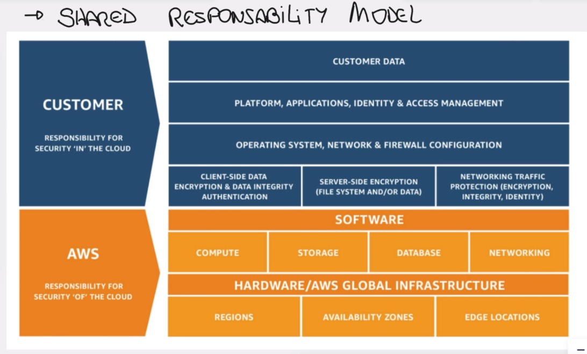

# Modelo de Responsabilidade Compartilhada ( Shared Responsability Model )

## Significado

Por mais que a AWS seja grande, ela não consegue cuidar de tudo e prever tudo, pos isso quando vamos contratar algum serviço, agt assina o termo de `responsabilidade compartilhada`, isso significa que algumas coisas a `AWS` vai tomar conta e outras `VOCÊ` deve tomar conta.

## Exemplo prático

`CUSTOMER:` VOCÊ 
`AWS:` quem prove os serviços.

### EXEMPLOS RESPONSABILIDADES DE SEGURANÇA DA AWS

- `AWS` Ela é responsável por tudo que o cliente(`customer`) não tem acesso, exemplo:
  - exemplo:

    - `[1][COMPUTE]` vamos supor que você contrata um serviço de `COMPUTE` que seria por exemplo um `servidor virtual`, porem entenda que esse `servidor virtual` está instalado em um `servidor físico` a pergunta que fica é, `será que eu tenho que me preocupar com a segurança desse servidor físico?` quem entra ou não no datacenter, se está com energia ou não o data center? `a resposta é NÃO`, não é a minha responsabilidade, é responsabilidade da `AWS`.

    -  `[2][STOTAGE]` seguindo a mesma linha de raciocínio, quem tem acesso aos discos?, quem deve fazer o backup deles? mesma coisa, tudo isso é responsabilidade da `AWS`

### EXEMPLOS RESPONSABILIDADES  DE SEGURANÇA DO CLIENTE(VOCÊ)

- `VOCÊ` é responsável por toda configuração que você faz ou não quer fazer, exemplos:

  - Você contrata o serviço `EC2` com windows e desativa o `FIREWALL` do windows, fazendo isso você está abrindo as portas para o "Mundo" e ai os `HACKERS` podem logar na sua máquina virtual, pq vc desabilitou o `FIREWALL`, e podem instalar algum sistema para ficar monitorando o seu servidor, podem elevar o processamento da maquina a `100%` fazendo com que os seus serviços da sua aplicação caiam, ou seja a `AWS` não é responsável por isso, essa seria `uma das suas responsabilidades ao contratar o serviço`.

  - Se você sobe uma aplicação sem token para ter segurança sem validação de usuário, e alguém consegue acessar e enviar comandos na sua aplicação, isso não é responsabilidade da AWS é `SUA RESPONSABILIDADE`.