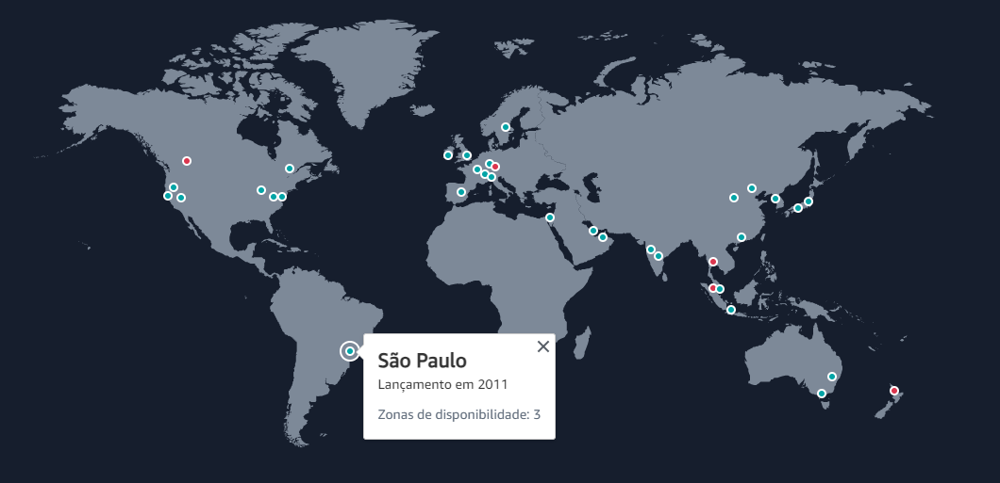

# Regiões AWS

## O que é uma região na aws?

- a aws fica instalada em várias regiões pelo mundo, no brasil atualmente ela só tem suas instalações em SÃO PAULO.
- o código da região é `sa-east-1` de South America-Leste-1

## Porque é importante saber qual região utilizar?

- antes de criar uma infra na aws, é importante verificar se os serviços que você precisa existe naquela região.
- pode existir serviços especificos que só funcionam em regiões específicas.
- exemplo: quero criar um serviço de storage (`S3 Bucket`)
- preciso verificar se na região `sa-east-1` que fica em São Paulo, existe esse serviço disponível
- como olho isso?
