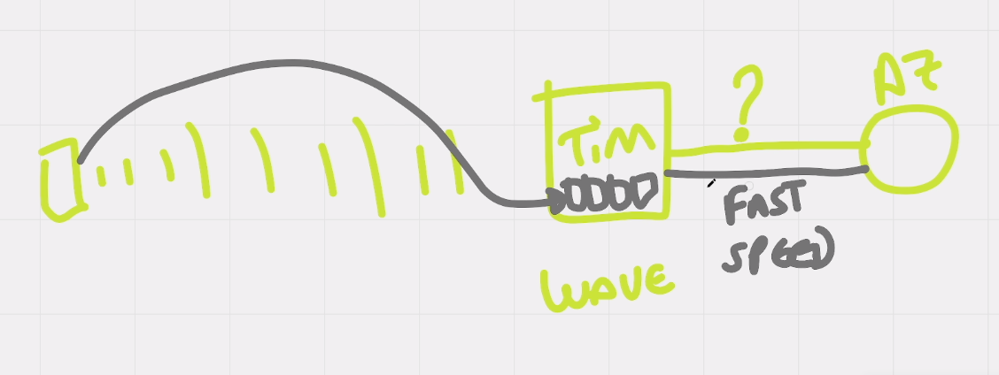

# AWS Wavelength

## Como funciona?

AWS Wavelength funciona para que dispositivos móveis com conexões a operadoras de celulares tenha o minimo de latencia possível ( abaixo de 10 millisegundos )

para tornar isso possível a AWS implementou datacenter DENTRO da provedora e pediu para quando o usuário estiver
tentando acessar algum dos serviços dela, para que redirecione via link direto para o servidores dela, fazendo
com que tire a latencia que existia antes quando era os datacenters da propria operadora pra dps mandar
para o data center da aws agora já chega na aws direto.