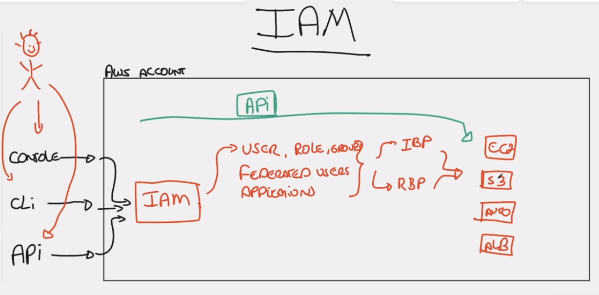

# Introdução ao IAM

> Significados:
>
> - IBP: Identity Base Policy -> conseguimos bloquear alguma identidade a partir dele.
> - RBP: Resource Base Policy - > conseguimos bloquear algum recurso a partir dele.
> - AUTO: Auto Scaling
> - ALB: AWS Load Balancer

## O que é o IAM?

**IAM** ou **Identity and Access Management** ( Identifidade e Gerenciamento de Acesso )

- Ele é um recurso que garante que você tem ou não `PERMISSÕES` para executar recursos da `AWS`.
- É nele que criamos nossos usuários, grupos, permissções e etc.

## Como acessar o IAM?

Podemos acessar por 3 formas:

- pela `WEB`
  - Login pela web normal passando as credenciais
- via `CLI`
  - Abrimos uma linha de comando passando as credenciais.
- via `API`
  - Fazemos requests passando as credenciais

## Dentro do IAM

- dentro dele conseguimos criar usuários e definir permissoes para esse usuário.
- conseguimos criar um grupo chamado `"admin" por exemplo`, e atribuir usuários para esse grupo
  - fazendo com que o usuário `HERDE` todas as permissões daquele grupo.

## IBP e RBP

Link ref: https://docs.aws.amazon.com/IAM/latest/UserGuide/access_policies_identity-vs-resource.html

## Resumo

Para acessar algum tipo de serviço da AWS como um `EC2` por exemplo, devemos configurar nosso usuário para que ele tenha acesso a esse recurso.

Exemplo posso dar acesso ao recurso `S3` para um usuário.

Posso criar 2 regras:

- um usuário vai ter a permissão de somente leitura do `S3`
- o outro usuário vai poder editar recursos do `S3`
