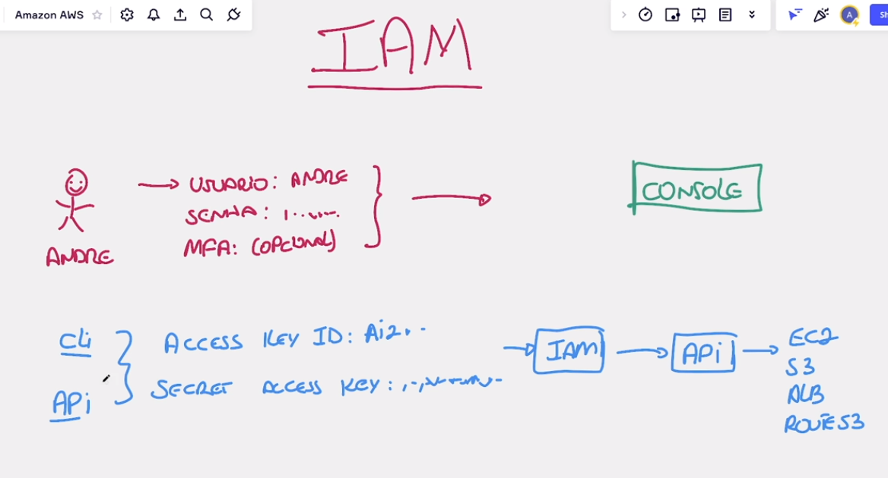

# Autenticação Console vs CLI/API

## Autenticação no Console

Para que você consiga logar no `Console da AWS`, você precisa desses itens, sendo um opcional.

- Usuario
- Senha
- MFA (opcional)

## Autenticação via CLI/API

Para que você consiga logar via `CLI/API` você vai precisar de duas coisas que `REPRESENTAM` o seu usuário e senha.

- `ACCESS KEY ID`
- `SECRET ACCESS KEY`

Ambos são como se fossem o seu usuário e senha.
