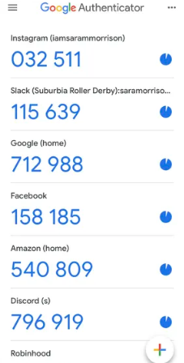
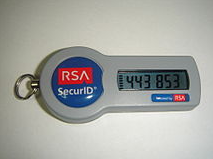

# Sobre o MFA (Multi Factor Authentication)

## Porque devemos utilizar o MFA?

Devemos utilizar pois ele é uma segurança a mais que tras para o seu login, hoje temos usuário e senha.
o MFA veio para que ao colocar usuário e senha, ele vai solicitar o seu MFA que geralmente pode ficar
em um dispositivo movel (digital) ou um dispositivo fisico.

Ou seja, se alguem conseguir seu usuário e senha, ele ainda vai precisar do seu celular ou seu aparelho fisico de MFA para conseguir saber sobre o código do MFA.

### MFA Digital:

### MFA Físico:

