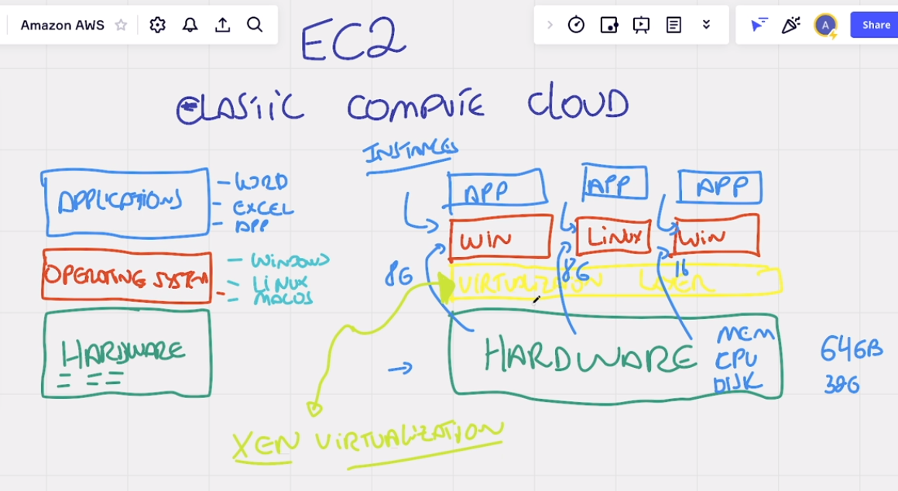
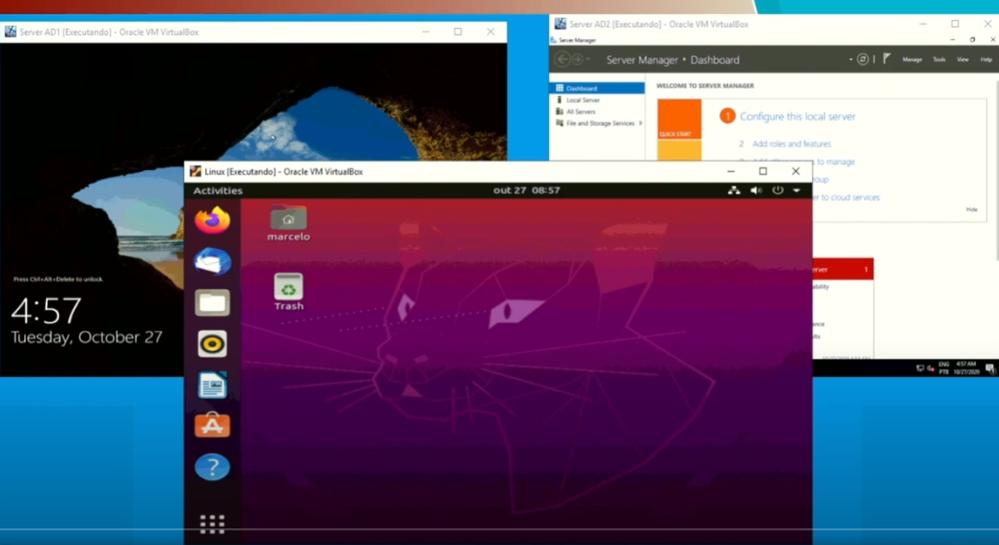

# O que é Virtualização?

> A FOTO DA ESQUERDA ERA COMO SE FAZIA ANTIGAMENTE QUE ERA LIMITADO A 1 HARDWARE PARA 1 SISTEMA OPERACIONAL

> A DA DIREITA É COMO A AWS FAZ HOJE EM DIA

## Como era antes da Virtualização existir?

Antigamente para cada maquina FISICA nós tinhamos UM sistema operacional

## Como é hoje com a virtualização?

Hoje para cada maquina FISICA podemos ter 1 ou MAIS sistemas operacionais

## Virtualização

É um processo onde rodamos vários computadores dentro de um único computador, é como se agt simulasse várias máquinas.

Um exemplo bom é esse logo abaixo:

Aqui temos um computador com windows, rodando 3 sistemas operacionais, ou seja virtualizou 3 sistemas, é como se tivessemos 3 maquinas do zero que poderiamos instalar coisas diferentes(ou iguais) em cada uma delas.

**Temos 3 sistemas:**

- 2 windows
- 1 linux
- 1 windows (o proprio computador que está processando tudo isso.)

# RESUMO

Ou seja, hoje a AWS trabalha da seguinte forma:

> A FOTO DA ESQUERDA ERA COMO SE FAZIA ANTIGAMENTE QUE ERA LIMITADO A 1 HARDWARE PARA 1 SISTEMA OPERACIONAL

> ACOMPANHA A EXPLICAÇÃO DA DIREITA

- ela tem um grande hardware como representado na primeira foto
- logo acima da camada de hardware ela tem uma camada de virtualização (XEN VIRTUALIZATION )
- essa camada de virtualização que faz a "orquestração" dos sitemas operacionais logo acima dessa camada
- e ai com o sistema pronto podemos instalar e configurar o que desejamos em cada sistema operacional.
