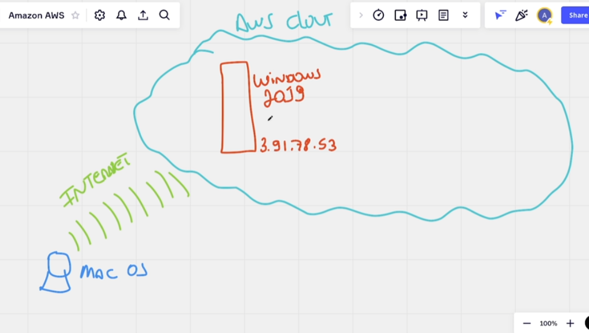

# Acessando a instancia (WINDOWS) EC2 que criamos

> IMPORTANTE: Ao selecionar uma instancia e clicar em `Instance state`, você pode mandar ela fazer algumas coisa
>
> - Stop instance: Para a instancia e se eu n me engano para de cobrar pelo uso dela.
> - Reboot instance: Reinicia a sua instancia
> - Terminate instance: Remove a sua instancia, uma vez feita não podera desfazer muito cuidado com esse aqui.

## Informações úteis

- Ao acessar a lista de instancias EC2 e clicarmos na instancia ID, vamos conseguir ver 2 pontos
  - IP Publico: fala dele(instancia) para fora da aws
  - IP Privado: fala dele(instancia) para dentro da aws
  - 
- Sempre que a instancia reiniciar o IP dela muda ( caso não tenha configurado o Elastic IP )
  - para evitar essa mudança
  - podemos criar um "Elastic IP" parae esse servidor e assim conseguimos um ip estatico (que nao muda)

## Conectando a sua instancia via RDP

1. Selecione a instancia que deseja indo em EC2 -> Instances
2. após selecionar a instancia clique em `Connect`
3. selecione a opção `RDP Client`
4. Clique na opção `Download remote desktop file`
   1. ele vai baixar um `.rdp` para que você consiga se conectar com a maquina.
5. Clique em `Get password`
6. cole a sua secret key ou clique em `Upload private key` e selecione ela.
7. após isso clique em `Decrypt password`
8. vai aparecer o `Password (sua senha descriptografada)`
9. você copia ela
10. de 2 clicks no `.rdp` que você baixou, e cole a senha que você copiou (descriptografada)
11. de um enter e aguarde que o seu servidor windows será carregado.
12. e fim você estará logado na sua maquina.
