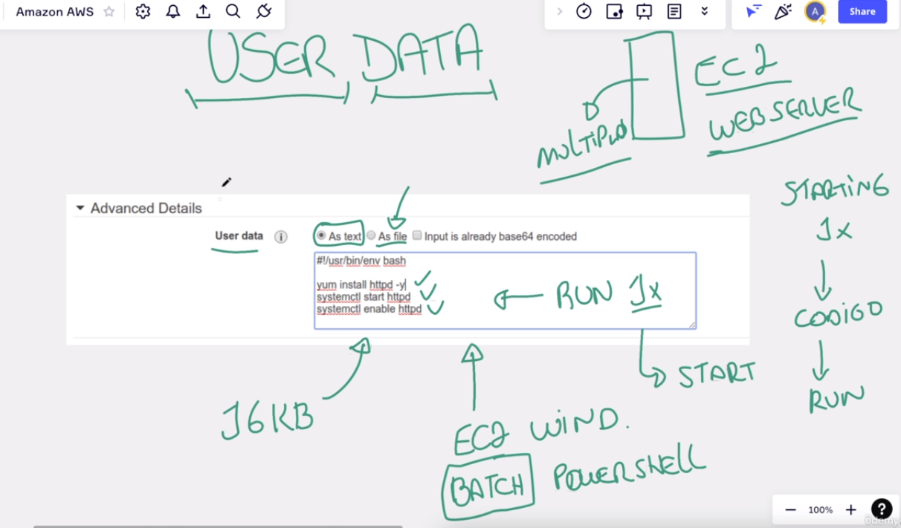

# User Data

## Importante

o código que você colocar no `User data` vai executar `APENAS UMA VEZ` quando o seu servidor inicializar
após isso ele não executa mais, somente se você reiniciar o servidor, ai quando inicializar novamente ele vai
executar novamente todas as dependencias.

## O que é?

São configurações iniciais do servidor que ele SEMPRE vai precisar rodar ao inicializar.

Exemplos:

- Mundo PC PESSOAL
  - tenho minha maquina windows e eu gostaria que o SKYPE abrisse toda vez que eu ligar o pc
- Mundo SERVIDOR
  - tenho um web server que PRECISA iniciar sempre que minha maquina iniciar

Com isso eu consigo instalar todas as dependencias necessárias para que meu web server rode sem problemas.

## Como posso rodar os scripts no User data?

- você pode tanto via texto, você coloca no textarea que tem lá,
- quanto em arquivo, ele te da a opção de você enviar um arquivo que já contenha os scripts que você deseja.

## Instancias do tipo WINDOWS

Podem rodar um batch ou powershell
