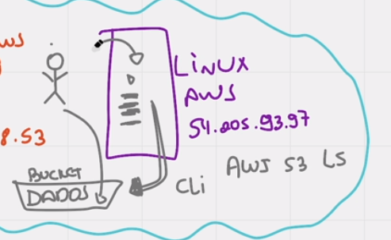

# Acessando S3 via EC2 com IAM User

> NÃO É RECOMENDADO POIS SE ALGUEM INVADIR O SERVIDOR, ELE CONSEGUE PEGAR AS CREDENCIAIS DANDO cd  
> cd ~/.aws 
> ls 
> cat credentials

> para remover as credenciais acesse `cd ~/.aws` e rode o comando `rm -rf *`

> **IMPORTANTE** é só para conhecimento, não utilize esse formato.

## Como acessar o S3 via EC2

### Criando um IAM User e pegando a Access e Secret Key

1. primeiramente vamos precisar ter `Usuário IAM` (IAM USER)
2. logue com sua conta root
3. crie um usuário IAM
4. adicione uma policie de full access ao s3
5. e crie o usuário
6. após isso acesse ele na lista de usuários
7. vá até a tab de `Security credentials`
8. procure por `Access key`
9. clique no botão de criar uma access key
10. selecione a opção `Application running on an AWS compute service`
11. aceite tudo e clique em `next`
12. de next até chegar a sua secret key e depois copie ela e a acces key e guarde em algum lugar.
13. com a sua `Access key` e `Secret key` acesse um `EC2 Linux`

### Acessando o S3 via EC2

1. já com a secret e access em maos
2. conecte a uma maquina linux
3. siga esses comandos:
   1. `sudo su`
   2. `aws configure`
   3. cole sua `Access Key` e de enter
   4. cole sua `Secret Key` e de enter
   5. veja qual é a região da sua EC2 e digite no console ( nesse caso é `sa-east-1` )
   6. aperte enter apenas
4. E pronto você já configurou o seu IAM User em sua EC2
   1. agora ela consegue ter acesso a tudo que o seu usuário tem acesso
   2. vamos tentar acessar o S3
   3. digite o comando abaixo:
      1. `aws s3 ls`
      2. `aws s3 ls s3://NOME_DO_SEU_S3`

## RESUMO

essa forma se baseia em você configurar DENTRO da maquina(EC2) as credenciais do SEU USUÁRIO para que a maquina consiga ter acesso ao S3, segue imagem explicativa:

