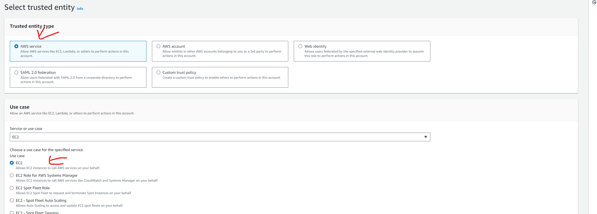
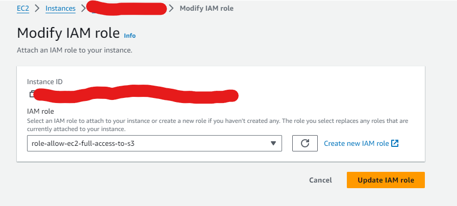

# Acessando S3 via EC2 com IAM Roles

## Como acessar o S3 via EC2

### Criando uma IAM Role

1. acesse o menu `IAM`
2. clique em `Roles`
3. clique em `Create Role`
4. escolha para qual finalidade vai servir essa role, no nosso caso é:
   1. 
5. clique em `Next`
6. escolha a permissão que deseja ( no caso do tutorial é `AmazonS3FullAccess`)
7. clique em `Next`
8. de um nome para essa `role`
9. clique em `Create role`
10. e pronto temos nossa role.

### Associando a ROLE criada a uma maquina EC2

1. acesse o menu `EC2`
2. escolha a máquina desejada clicando nela
3. clique em `Actions` -> `Security` -> `Modify IAM role`
4. selecione a role desejada e pronto sua ec2 já vai possuir os acessos que você permitiu na role.
5. 

# RESUMO

Dessa forma com IAM Role, eu falo para o LINUX (EC2) ir na IAM Role, verificar se essa Role tem acesso ao S3
e se tiver acesse o Bucket S3
