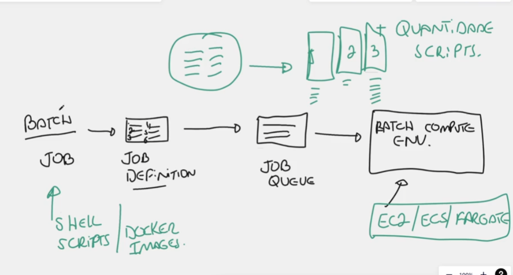

# AWS Batch ( LOTE = Grupo )

## O que é?

É um serviço da AWS que foi criado para rodar scripts em LOTE em grande quantidade. 
podemos executar `batch` para os serviços: `EC2/ECS/FARGATE`

- `JOB:`
  - podemos trabalhar com:
    - `shell scripts`
    - `docker images`
- `JOB Definition:`
  - é onde faremos uma definição do que é que nós queremos rodar.
- `JOB Queue:`
  - pega tudo que foi definido em `JOB Definition` e coloca em `FILAS`.
- `BATCH COMPUTE ENV:`
  - aqui é o final que ele pega a ordem da fila em `JOB Queue` e começa a executar.
