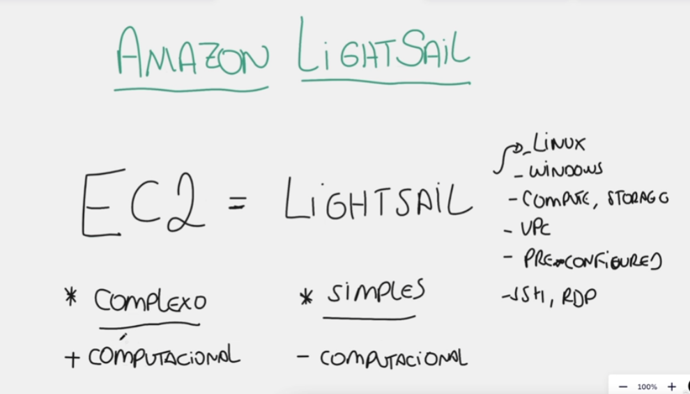

# AWS LightSail

## O que significa LightSail?

Sail -> Navegar
Light -> Suave

"Navegar com uma facilidade maior"

## LightSail

- LightSail é um `EC2` mais `simples` eu consigo navegar pelo EC2 de forma mais simples.
- Enquanto o `EC2` tem diversas configurações o `LightSail` já deixou as principais apenas.

## Diferença entre EC2 e LightSail

| EC2                       | LightSail                      |
| ------------------------- | ------------------------------ |
| **+completo**             | **-complexo**                  |
| **+computacional**        | **-computacional**             |
| **para projetos grandes** | **para projetos mais simples** |
