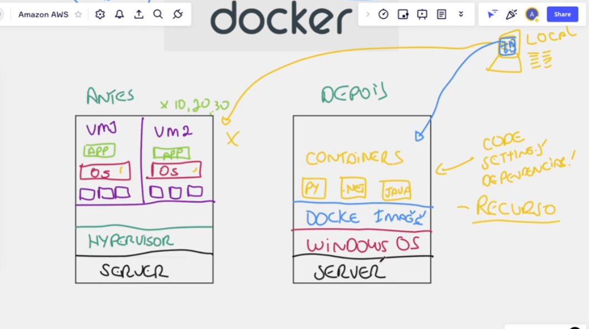

# Introdução ao Docker

Sugestão de pesquisa: Docker vs Virtual Machine 
Link ref: https://cloudacademy.com/blog/docker-vs-virtual-machines-differences-you-should-know/

- `Virtual Machine:` Era utilizada antigamente para criar aplicações
- `Docker Engine:` Hoje utizamos docker, pois gasta muito menos recurso.

## Diferença entre VM e Docker

| VM                                  | Docker                                          |
| ----------------------------------- | ----------------------------------------------- |
| para cada VM, você precisa de um SO | docker não precisa de um SO para cada container |
| **[1]** conflito de dependencias    | **[1]** sem conflitos de dependencias           |

- **[1]** Antigamente
  - com as VMs, agt configurava a aplicação com base no SO da nossa maquina, exemplo: era `WINDOWS` e codavamos baseado nisso, quando agt buildava e jogava na VM, lá era `LINUX` então dava conflito de configurações/dependencias.
  - Hoje com Docker a configuração é uma só, pois o criamos uma `docker image` e quando subimos, sobe como `docker image` então não tem nenhum conflito

## Vantagens do DOCKER

- não precisa de um SO para cada container
- sem conflitos de dependencias
- é rapido
- é escalavel, posso pegar um container que está no servidor X e migrar para o servidor Y que nada será afetado.
- consome menos recursos
