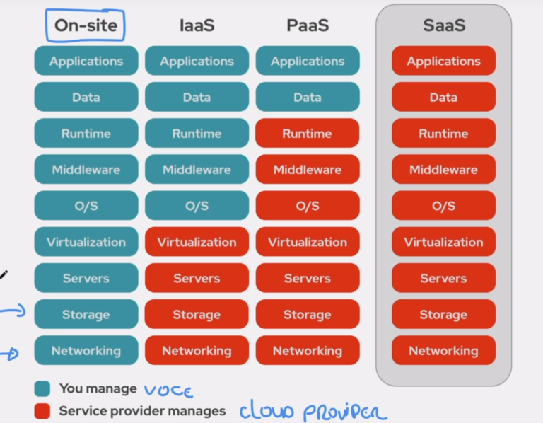

# Tipos de Cloud

##  [1] IaaS ( Infrastructure as a Service )

O que isso significa? 
Que pagamos a AWS para utilizar a infraestrutura dela como serviço.

Se pagarmos pela Infraestrutura, eles gerenciam a infraestrutura e o resto é sob nossa responsabilidade.

## [2] PaaS ( Platform as a Service )

O que isso significa? 
Que pagamos a AWS para utilizar a plataforma dela como serviço.

Se pagarmos pela Plataforma, eles gerenciam a Plataforma e você gerencia a aplicação que está no topo da plataforma.

## [3] SaaS ( Software as a Service )

O que isso significa? 
Que pagamos a AWS para utilizar a plataforma dela como serviço.

Se pagarmos pelo `SaaS` eles gerenciam a aplicação e nós não fazemos literalmente quase nada.

## O que você gerencia em cada tipo de serviço contratado?

`On-site (On Premise):` significa que está tudo dentro da sua empresa 
`VERDE:` VOCÊ GERENCIA 
`VERMELHO:` A NUVEM GERENCIA 

## Classificando [1] IaaS [2] PaaS [3] SaaS

`IaaS`:
- EC2

`PaaS`:
- beanstalk (é uma plataforma que gerencia a estrutura para nós)

`SaaS` (geralmente chamamos `SaaS` como usuário final):
- CRM (só o usuário final usa)
- OFFICE 365 (só o usuário final usa)
- Google Docs
- Gmail

 
 

> Todos esses tipos funcionam como uma escala. 
> para utilizar o `PaaS` você vai precisar utilizar também o `IaaS` 
> para utilizar o `SaaS` você vai precisar utilizar também o `PaaS` e o `IaaS` 
