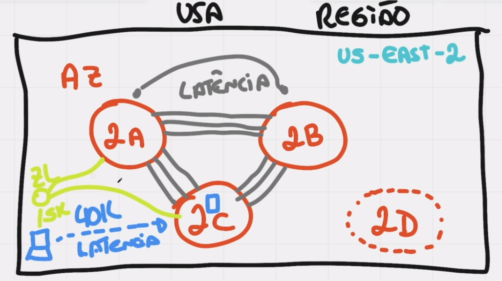

# Zonas Locais

> em `VERDE` a imagem representa a `ZONA LOCAL` em `VERMELHO` representa `AZ(Zona de Disponibilizada)`

## O que é uma Zona Local?

A AWS disponibiliza AZs em determinadas regiões, exemplo: no Brasil a AWS tem apenas uma região: São Paulo,
que contem 3 zonas de disponibilidades com um ou mais data centers.

POREM pode ser que alguém da bahia esteja acessando um site hospedado na amazon ou jogando um jogo hospedado na amazon, isso vai criar uma latencia até passar por toda a infra de cabos e etc e chegar nas AZs.

Pensando nisso ela criou a `Zona Local` que basicamente são pequenos datacenters próximo a regiões de grande população.

Ou seja a `Zona local` faz conexão com as outras `AZs` porem a diferença é que a `Zona local` está em uma distância
muito menor do usuário comparado a uma `AZ`.