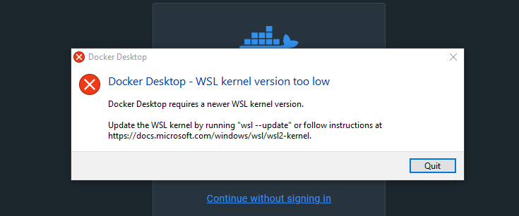

# DOCKER

## Como instalar?

1. va até https://www.docker.com/products/docker-desktop/
2. clique em Download for windows
3. após baixar de um duplo clique no executavel
4. clique em next next até finalizar a instalação
5. pesquisa na barra de pesquisa do windows por docker e fixe ele a sua barra de ferramentas
6. ao executar o docker na minha maquina deu esse erro:
   
7. para solucionar esse erro eu vi esse video: https://www.youtube.com/watch?v=zvnFtNlD1eo
8. o video por si só ja resolveu o problema, caso o video fique fora do ar segue a descrição a explicação abaixo: 
   1. 1. Open the Control Panel on your Windows machine
   2. Click on "Programs" and then "Turn Windows features on or off"
   3. Check the boxes for "Windows Subsystem For Linux", "Windows Hypervisor Platform", and "Virtual Machine Platform", then click "OK"
   4. Open PowerShell as an Administrator
   5. Type in the command: dism.exe /online /enable-feature /featurename:Microsoft-Windows-Subsystem-Linux /all /norestart, then press Enter to enable WSL 1
   6. Download the WSL 2 update from Microsoft: https://aka.ms/wsl2kernel
   7. Install the update by double-clicking on the downloaded file
   8. Open PowerShell as an Administrator
   9. Type in the command: wsl --set-default-version 2, then press Enter to set WSL 2 as the default version
   10. Restart your computer to ensure the changes take effect