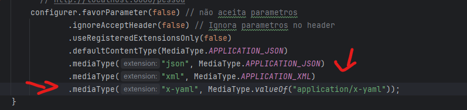
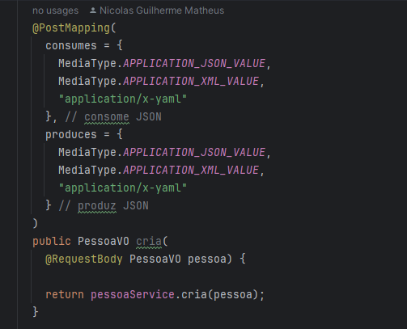
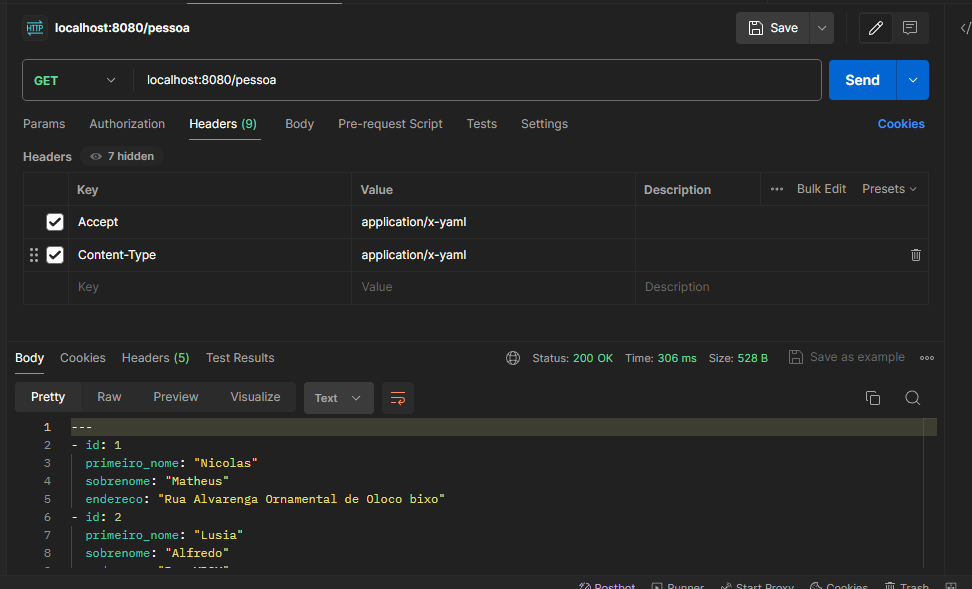
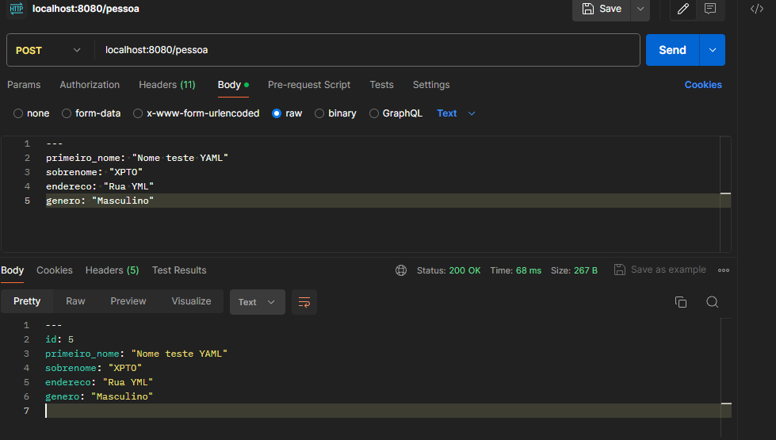

# O que significa "Content Negociation"

É a capacidade do nosso servidor `REST` disponibilizar diferentes versões de um mesmo objeto.
ou seja, posso devolver `JSON` `XML` `YML` `CSV` `PDF` `PNG` enfim..

Além disso, pode estar relacionado a um tipo de linguagem(idioma)
Exemplo:

A nossa API suporta `internacionalização` e eu posso devolver a resposta em português ou espanhol ou ingles

## Resumo

é a capacidade da nossa api de fornecer diferentes tipos de dados `JSON` `XML` `YML` `CSV` `PDF` `PNG` e/ou idiomas.

claro que a API(`SERVER-DRIVEN`) tem que estar preparada para que o cliente(`Agent-driven`) solicite oq ele deseja.

# Como IMPLEMENTAR?

1. No seu pom, adicione essa dependencia:

```
		<dependency>
			<groupId>com.fasterxml.jackson.dataformat</groupId>
			<artifactId>jackson-dataformat-xml</artifactId>
		</dependency>
```

2. essa dependencia faz conversoes para xml, se desejar outro formato, procure pro "jackson yml" "jackson csv" e etc..
3. com a extensão instalada.
4. crie o arquivo `WebConfig` dentro de: `package br.com.nicolas.config` e adicione essa configuração:

```
package br.com.nicolas.config;

import org.springframework.context.annotation.Configuration;
import org.springframework.http.MediaType;
import org.springframework.web.servlet.config.annotation.ContentNegotiationConfigurer;
import org.springframework.web.servlet.config.annotation.WebMvcConfigurer;

/*
* a annotation @Configuration diz para o spring boot, que quando ele estiver carregando a aplicação
* ele precisa ler essa classe pq nela vai encontrar configurações sobre o comportamento da aplicação.
* */
@Configuration
public class WebConfig implements WebMvcConfigurer {

    @Override
    public void configureContentNegotiation(ContentNegotiationConfigurer configurer) {
        //https://www.baeldung.com/spring-mvc-content-negotiation-json-xml
        // WebMvcConfigurer.super.configureContentNegotiation(configurer);
        // http://localhost:8080/pessoa?mediaType=xml
        // Configuração via QueryParam
        configurer.favorParameter(true) // Aceita parametros
                .parameterName("mediaType") // nome do parametro aceito
                .ignoreAcceptHeader(true) // Ignora parametros no header
                .useRegisteredExtensionsOnly(false)
                .defaultContentType(MediaType.APPLICATION_JSON)
                .mediaType("json", MediaType.APPLICATION_JSON)
                .mediaType("xml", MediaType.APPLICATION_XML);
    }

        // CONFIGURAÇÃO VIA HEADER
        // http://localhost:8080/pessoa
        configurer.favorParameter(false) // não aceita parametros
          .ignoreAcceptHeader(false) // Ignora parametros no header
          .useRegisteredExtensionsOnly(false)
          .defaultContentType(MediaType.APPLICATION_JSON)
          .mediaType("json", MediaType.APPLICATION_JSON)
          .mediaType("xml", MediaType.APPLICATION_XML);
}

```

5. após isso você precisa configurar os seus endpoints para produzirem `XML` por exemplo, e receberem `XML` (`produces/consumes`)
6.

```
  @PostMapping(
    consumes = {
      MediaType.APPLICATION_JSON_VALUE,
      MediaType.APPLICATION_XML_VALUE,
    }, // consome JSON
    produces = {
      MediaType.APPLICATION_JSON_VALUE,
      MediaType.APPLICATION_XML_VALUE,
    } // produz JSON
  )
  public PessoaVO cria(
    @RequestBody PessoaVO pessoa) {

    return pessoaService.cria(pessoa);
  }
```

7. o seu endpoint agora retorna xml, basta passar mediaType=xml como queryParam
8. exemplo: `http://localhost:8080/pessoa?mediaType=xml`

<br>

# Serializando para YML

<br>

1. adicione a dependencia ao `pom.xml`
   ```
     <dependency>
       <groupId>com.fasterxml.jackson.dataformat</groupId>
       <artifactId>jackson-dataformat-yaml</artifactId>
     </dependency>
   ```
2. agora criaremos um pacote dentro de br.com.xpto.**serialization.converter**
3. agora precisamos criar uma classe e vamos chamar de `YamlJackson2HttpMessageConverter`
4. e vamos extender o `AbstractJackson2HttpMessageConverter`, como mostra o exemplo abaixo:
   ```
    public class YamlJackson2HttpMessageConverter extends AbstractJackson2HttpMessageConverter {}
   ```
5. cole esse código para ele já adicionar todas as dependencias:
   ```
   public class YamlJackson2HttpMessageConverter extends AbstractJackson2HttpMessageConverter {
      public YamlJackson2HttpMessageConverter() {
        super(
          new YAMLMapper().setSerializationInclusion(JsonInclude.Include.NON_NULL), // deixamos como NON_NULL para quando um campo estiver como nome: null, ele não inclua ele.
          MediaType.parseMediaType("application/x-yaml")
        );
      }
    }
   ```
6. e pronto nossa classe já está configurada, agora devemos configurar nosso `WebConfig.java` para aceitar yml também
7. 
8. após adicionar `.mediaType("x-yaml", MEDIA_TYPE_APPLICATION_YML);` ao seu WebConfig
9. vá para a sua controller e coloque `"application/x-yaml"` tanto para o `consumer` quanto para o `producer`, como no exemplo abaixo:
10. 
11. após isso adicione o extendMessageConverters dentro do seu arquivo `WebConfig.java`:

```
   @Override
   public void extendMessageConverters(List<HttpMessageConverter<?>> converters) {
       converters.add(new YamlJackson2HttpMessageConverter()); // adicionando o meu converter customizado para yml
   }
```

12. e pronto podemos testar nosso endpoint de pessoa no postman fazendo uma requisição `GET` passando o
    `Content-Type` e `Accept` como `application/x-yaml` como no exemplo:
    
13. como colocamos produces e consumes no post, podemos enviar também um YML no body, segue um exemplo:
    
