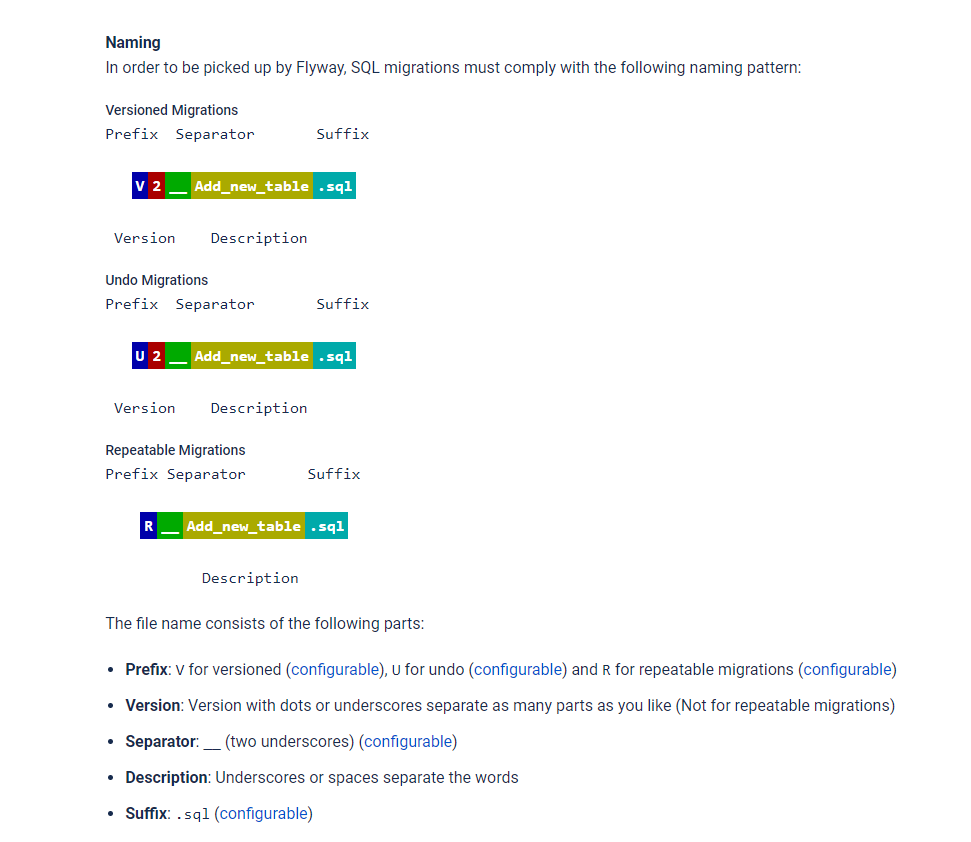

# Flyway

## O que é?

- É uma ferramenta que te possibilita exucutar migrações no banco.
- Desfazer migrações
- Pode fazer migrações baseadas em `SQL`
- Migrações repetidas que a cada execução ela é recriada.
- Existem `MIGRATIONS` baseadas em código JAVA/KOTLIM 
- Versionamento de `.sql`
  - 