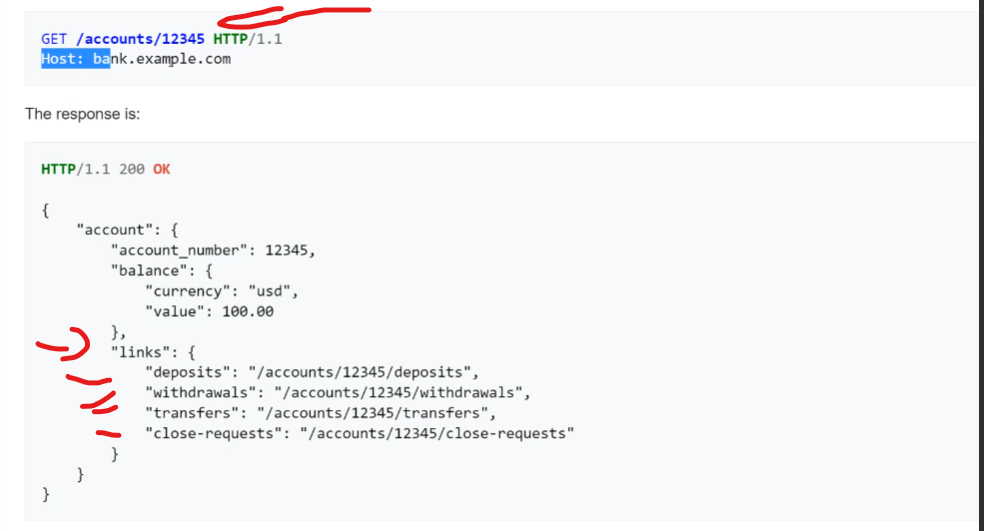
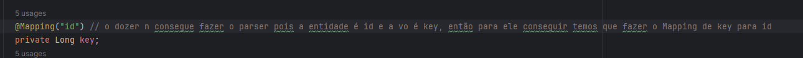

# O que é HATEOAS?

Basicamente para uma API ser considerada RESTFull (Lembre dos 4 estados para ser uma API RESTFull), ela precisa ter `HATEOAS`, ou seja os seus endpoints
devem retornar dentro deles o link para outras possíveis referências do mesmo endpoint, segue exemplo:



---

<br>

## Como adicionar `HATEOAS` em seu projeto?

<br>

1. adicione ao pom a dependencia:

   ```
   <dependency>
     <groupId>org.springframework.hateoas</groupId>
     <artifactId>spring-hateoas</artifactId>
   </dependency>
   ```

2. vá até a sua `VO` no meu caso PessoaVO e extenda o `RepresentationModel`, como no exemplo:

   ```
   public class PessoaVO extends RepresentationModel<PessoaVO> {}
   ```

3. Caso sua `VO` tenha a propriedade `id` mude o nome dela, pois vai conflitar com o `RepresentationModel`,
   nesse exemplo vamos mudar de `id` para `key`

4. caso sua entidade esteja como id, você deve fazer um Mapping do key, para que os testes funcionem, dentro de PessoaVo, segue exemplo:
   

## Após feita as configurações anteriores, vamos aplicar o HATEOAS

### Aonde costuma ser aplicado o HATEOAS?

- Ele costuma ser aplicado na `Controller` porem vou adicionar na `Service` que é onde fica as regras de negócio.
- na service `PessoaService` vamos importar as dependencias:
  ```
  import static org.springframework.hateoas.server.mvc.WebMvcLinkBuilder.linkTo;
  import static org.springframework.hateoas.server.mvc.WebMvcLinkBuilder.methodOn;
  ```
- e vamos o metodo buscaPorId de:
  ```
  public PessoaVO buscaPorId(Long id) {
    Pessoa entity = buscaPorIdEntity(id);
    return DozerMapper.parseObjeto(entity, PessoaVO.class);
  }
  ```
- para:
  ```
  public PessoaVO buscaPorId(Long id) {
    Pessoa entity = buscaPorIdEntity(id);
    PessoaVO vo = DozerMapper.parseObjeto(entity, PessoaVO.class);
    vo.add(linkTo(methodOn(PessoaController.class).buscaPorId(id)).withSelfRel());
    return vo;
  }
  ```
- Explicação:<br>
  `vo.add(linkTo(methodOn(PessoaController.class).buscaPorId(id)).withSelfRel());`<br>
  peguei a `vo` que vou retornar e antes de retornar ela eu vou adicionar um `link de referencia`<br>
  dizendo que eu quero linkar(`linkTo`) <br>
  ao metodo (`methodOn`) -> buscaPorId <br>
  e também digo para ser a referencia dele mesmo para que no response fique como `self` <br>
  segue response de exemplo: <br>
  ```
  "_links": {
    "self": { // representa o .withSelfRel()
      // representa o conjunto "linkTo(methodOn(PessoaController.class).buscaPorId(id)"
      "href": "http://localhost:8080/pessoa/1"
    }
  }
  ```
