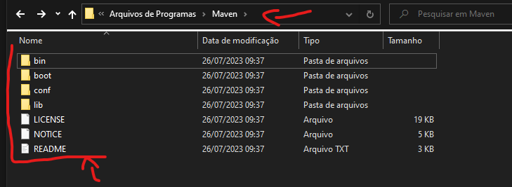

# MAVEN

## DICAS

Caso de erros absurdos que não deveriam acontecer, pode ser alguma dependencia que foi baixada e está corrompida, ai para resolver você vai na pasta .m2 que geralmente fica localizada na pasta do usuário exemplo `C:\Users\nicol\.m2` ai vc deleta e importa novamente o projeto ele vai recarregar e baixar as dependencias novamente, sem estar corrompida resolvendo o problema.

## Para que serve?

Ele gerencia as nossas dependencias, baixa as nossas dependencias ele é `SIMILAR` ao `NPM ( Node Package Maneger )`

O Maven procura as dependencias dentro do pom.xml (Project Object Model) baixa todas as dependencias e armazena em um repositório local, localizado no diretório .m2 dentro do diretório do usuário

## Como configurar?

1. faça o download: https://maven.apache.org/download.cgi
preferencia por "Binary zip archive" na hora de escolher uma opção de download.
2. Após baixar descompacte o zip e renomeie ele apenas para `Maven`
3. copie a pasta toda `Maven` e cole dentro de `C:\Program Files`
4. copie o path onde colocou `C:\Program Files\Maven` pois vc vai utilizar para configurar nas variaveis de ambiente (se não souber usar as configs de ambiente nessa doc aqui procure pela pasta JAVA/anotacoes.md) lá explica como faz.
5. Já nas variaveis de ambiente adicione uma nova variavel de KEY: `M2_HOME` e value `C:\Program Files\Maven`
6. Vá na variavel `Path` clique em edit, depois em novo e adicione esse valor `%M2_HOME%\bin` que é aonde está o executavel do `MAVEN`
7. Verifique se foi instalado com sucesso, entre no terminal e digite `mvn -v`
8. se não aparecer a versao do maven, você fez alguma coisa errada, verifique se sua pasta nesse caminho (`C:\Program Files\Maven`) está igual a da foto, caso não esteja deixei igual.

