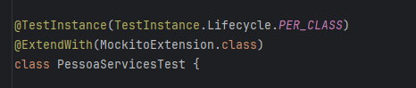

# JUnit

### Anotações e seus significados

- `@TestInstance(TestInstance.Lifecycle.PER_CLASS)`: a anotação é utilizada para definir o ciclo de vida da instancia de teste. 
  junto dela temos duas opções de parametros:

  - `PER_CLASS`
    - Quando usamos esse modo, um novo teste de instancia vai ser criado uma vez por classe de teste.
  - `PER_METHOD`
    - Quando usamos esse modo, um novo teste de instanvia vai ser criado para cada metodo ou metodo de fábrica de testes.
  - 

- `@ExtendWith(MockitoExtension.class)`: utilizamos o `ExtendWith` na classe para que a classe Herde todas as funcionalidades do Mockito.

  - O `@ExtendWith` é geralmente utilizando para extender alguma coisa.
    

- `assertNotNull`: verifica se algo do seu teste não é nullo, exemplo `assertNotNull(pessoa.getNome());`
- `assertTrue`: verifica se a condição é verdadeira
- `assertEquals`: verifica se o primeiro parametro que voce passou é igual ao segundo
