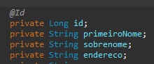

# Lista de annotation em JAVA.


# Diferenças entre PathVariable e RequestParam

- `@RequestParam` você pode passar vários parâmetros no client que o endpoint não dará erro
- `@PathVariable` já com path, se você passar path não esperado pelo endpoint dará erro.

<br>
<br>

# ORDENAR Serialização APENAS NO JSON/RESPONSE

<details>
  <summary>@JsonPropertyOrder</summary>
  
`@JsonPropertyOrder` permite ordenar a sua DTO, mostrando para o front na ordem desejada,
  - suponhamos que seu json retorna para o front: 
	```
		{
			"id": 1,
			"cpf: 000000000,
			"nome: "Nome Xpto"
		}
	```
  - mas ele precisa ser na ordem `id` `nome` `cpf`, para fazer isso basta colocar essa annotation na DTO
    - `@JsonPropertyOrder({"id", "nome", "cpf"})`
		```
			{
				"id": 1,
				"nome: "Nome Xpto",
				"cpf: 000000000
			}
		```
  - segue exemplo:
  - 

</details>   

<br>
<br>


<details>
  <summary>@RestController</summary>
  
  `@RestController`: indica para o framework que se trata de um controlador Rest, voltado para o desenvolvimento de aplicações web Restful e facilita que nós lidemos com requisições web (POST, GET, PUT, etc) pois une o Controller a um ResponseBody para todos métodos marcados pelo RequestMapping.<br>
   
  

</details>  
<details>
  <summary>@RequestMapping</summary>
  
  `@RequestMapping`: Tipos de parâmetros e significados:
   1. `path`: indica qual endpoint será
   2. `method`: qual verbo http esse metodo vai ter
   3. `produces`: indica qual `MediaType` esse endpoint vai `PRODUZIR/RETORNAR`, geralmente um `JSON` -> `MediaType.APPLICATION_JSON_VALUE`
   4. `consumes`: indica qual `MediaType` esse endpoint vai `RECEBER/CONSUMIR`, geralmente um `JSON` -> `MediaType.APPLICATION_JSON_VALUE`
   5. para se tornar um endpoint, você  precisa adicionar essa annotation passando o caminho do endpoint.
      1. endpoint sem parametros na url (path param)
      

      2. Endpoint com parametros na url (path param)
      

</details>  
<details>
  <summary>@RequestParam</summary>
  
  `@RequestParam`: para que o metodo receba parametros no endpoint vc deve utilizar essa annotation
    

</details>  
<details>
  <summary>@PathVariable</summary>
  
  `@PathVariable`: recupera as variaveis declaradas dentro de `@RequestMapping` do exemplo `2.2`. 
   1. Segue exemplo:<br>
   

</details>  
<details>
  <summary>@ResponseStatus</summary>
  
  `@ResponseStatus`: diz o status que a classe irá retornar (400, 500, 200 e etc.)

</details>  
<details>
  <summary>@ControllerAdvice</summary>
  
  `@ControllerAdvice`: ele funciona como um interceptor, no exemplo de tratamento de exceções, 
se colocado em um handler de exceções ele vai ser ativado toda vez que o código identificar que não existe um tratamento específico para aquela exceção vai cair na nossa exceção generica.

</details>  
<details>
  <summary>@ExceptionHandler(Exception.class)</summary>
  
  `@ExceptionHandler(Exception.class)`: Essa annotation filtra e diz para o metodo que está abaixo dela qual
   o tipo de exeção o metodo deve rodar a lógica dele nesse exemplo estou falando para que ele rode apenas 
   para exceções do tipo `Exception.class` significa que eu só quero que ele rode para exceções `GENÉRICAS`
   que na sua maioria são exceções do tipo erro 500, segue um exemplo de implementação dessa annotation.
   exemplo:<br>
   

</details>  
<details>
  <summary>@Service</summary>
  
  `@Service`: Indica para o spring boot que esse objeto será Injetado em RUN TIME em outras classes
   da nossa aplicação, segue exemplo:
   

</details>  
<details>
  <summary>@Autowired</summary>
  
  `@Autowired`: cuida da instaciação de uma classe de forma dinâmica em tempo de execução, segue exemplo em foto.
   1. Antigamente:<br>
      
   2. Hoje em dia:<br>
      
   3. Para que você consiga fazer isso com outras classes que não possuem a annotation `@Service`,
      essa classe deve possuir a annotation `@Component`, ou um Alias para ela, segue exemplo:<br>
      <br>
      no exemplo acima só conseguimos utilizar `@Autowired` com `@Service` pq `@Service` tem um aliasFor `@Component`

</details>  
<details>
  <summary>@RequestBody</summary>
  
`@RequestBody`: é com ele que indicamos para o parâmetro do metodo que vamos receber um Body nesse metodo, segue exemplo:<br>
    

</details>    
<details>
  <summary>@Entity</summary>
  
`@Entity`: diz para o Hibernate que a classe representa uma tabela do banco.<br>
   

</details>    
<details>
  <summary>@Table(name = "pessoa")</summary>
  
`@Table(name = "pessoa")`: passamos para a `Entity` a qual tipo de tabela ela pertence passando o nome da tabela.<br>


</details>    
<details>
  <summary>@Id</summary>
  
`@Id`: Indica para o `hibernate` qual é a `PK` dentre todas as propriedades<br>
   

</details>    
<details>
  <summary>@GeneratedValue(strategy = GenerationType.IDENTITY)</summary>
  
`@GeneratedValue(strategy = GenerationType.IDENTITY)`: indica para o `hibernate`  que aquela prop deve ser autoincremental ou seja adicionar 1 ao id a cada nova persistencia.<br>
    

</details>    
<details>
  <summary>@Column(name = "primeiro_nome")</summary>
  
`@Column(name = "primeiro_nome")`: define o nome da propriedade no banco de dados
    1. `name`: passa o nome da coluna que você deseja que seja no banco de dados
    2. `nullable`: define se você quer que essa prop seja ou não nulla no banco
    3. `length`: indica o maximo de caracteres que pode ter essa coluna
    4.  Se você definir apenas `@Column` ele vai assumir o nome da prop como padrão, segue os 2 exemplos<br>
    
    

</details>    
<details>
  <summary>@Repository</summary>
  
`@Repository` a interface com essa annotation permite o acesso ao banco de dados, e
   já habilita todas as operações de CRUD segue exemplo:<br>
    1. 
    2. lembrando que `JpaRepository<SEU_OBJETO_ENTIDADE, TIPO_DO_ID_PK_DA_ENTIDADE>`
    3. no exemplo da foto foi `Pessoa` como entidade/objeto e `Long` como tipo do id. segue exemplo:<br>
      

</details>    
<details>
  <summary>@JsonProperty</summary>
  
  ### Mudar nome da propriedade APENAS NO JSON/RESPONSE

-	`@JsonProperty` define um nome de propriedade que será retornado no JSON/RESPONSE do endpoint
	não afetando o nome da propriedade interna no back-end, exemplo:
	- alterando o código:
		```
			@JsonProperty("primeiro_Nome")
			private String primeiroNome;
		```
	- retorno do endpoint: 
		```
			{
				"id": 1,
				"primeiro_Nome": "Nicolas",
				"sobrenome": "Matheus",
				"endereco": "Rua Alvarenga Ornamental de Oloco bixo",
				"genero": "Masculino"
			},
		```


</details>
<details>
  <summary>@JsonIgnore</summary>
  
  ### Não enviar a propriedade APENAS NO JSON/RESPONSE
  
  `@JsonIgnore` -> faz com que a propriedade não seja enviada no response.


</details>