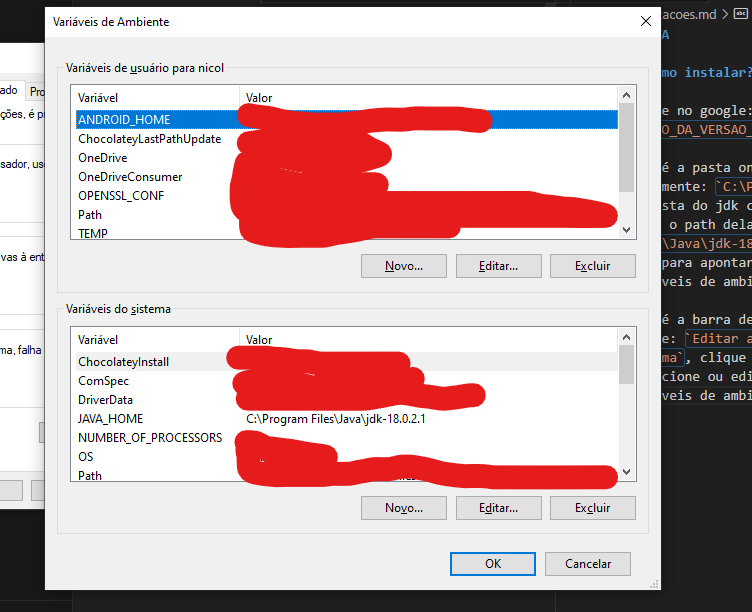
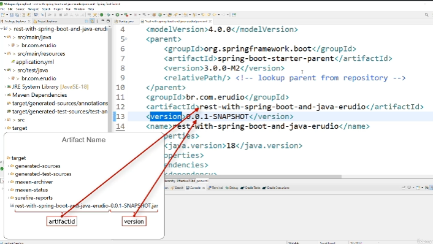
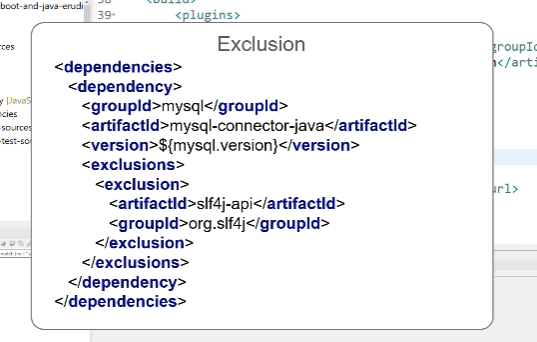
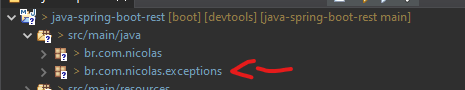
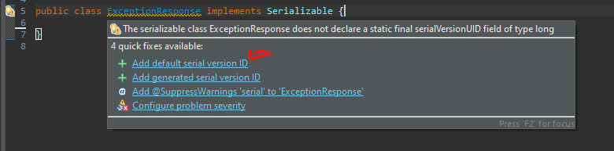
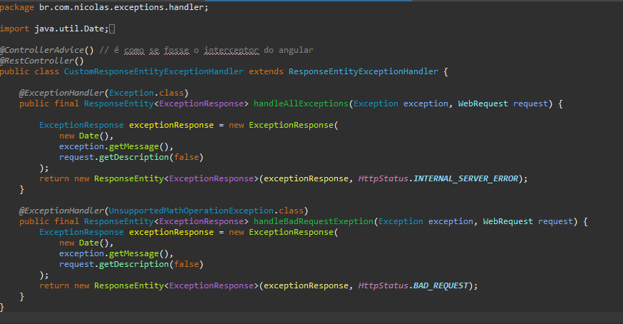

# JAVA

<details>
  <summary>Como instalar?</summary>

  ## Como instalar?

  digite no google: `JAVA SE ORACLE NUMERO_DA_VERSAO_DESEJADA`

  Vá até a pasta onde foi instalado o JAVA, geralmente: `C:\Program Files\Java` entre na pasta do jdk com a versao que escolheu e copie o path dela, exemplo: `C:\Program Files\Java\jdk-18.0.2.1`, você vai precisar dele para apontar esse path lá nas variaveis de ambiente do Windows

  Vá até a barra de pesquisa do windows digite: `Editar as variaveis de embiente do sistema`, clique em `variaveis de ambiente` e adicione ou edite o JAVA_HOME as Variaveis de ambiente como no exemplo abaixo:

  

  após isso cliente logo abaixo na variável Path depois clique no botão editar e caso não tenha adicione `%JAVA_HOME%\bin` ao `Path`
</details>

<details>
  <summary>Atalhos</summary>

  ## Atalhos

  1. `CTRL+SHIT+I` selecione o código em modo debug e aperta ele vai rodar apenas aquela linha, mas também pode ser um bloco e etc, importante só vai executar se o debugger já pasosu por ele.
  2. `CTRL+SHIFT+R` busca classes
  3. `CTRL+H` busca no workspace na tab file search você busca por uma string ou nome de classe funcção e etc igual no vs code na busca
  4. `CTRL+ALT+H` vc seleciona o método e da esse comando ele vai buscar todos os lugares que estão chamando esse metodo
  5. `ALT+SHIFT+S` abre um menu e vc pode gerar um construtor a partir das props criadas pode gerar get e set e por ai vai.
  6. `CTRL+ALT+ SETA PARA BAIXO` copie tudo que você deseja duplicar para a linha abaixo e use esse atalho.
</details>

<details>
  <summary>Estrutura de pastas</summary>

  ## Estrutura de pastas, como funciona?

  - `src/main/resources`: Aqui geralmente guardamos recursos estaticos.
  - `src/test/java`: Aqui adicionando os testes
  - `target`: quando compilarmos o java, gera um .jar dentro dessa pasta
  - `pom.xml`: aonde fica todas as dependencias do projeto (`package.json`)
    - `<modelVersion>`: a versao do pom
    - `<parent>`: é o pai, funciona como herança, quem está declarado em parent é o pai e o projeto que utiliza ele são os filhos
    - `groupId`: o identificador da estrutura de pacotes
    - `artifactId`: define o nome do artefato final
    - dentro do pom na raiz temos duas infos, essas duas infos que dão nome ao .jar gerado por nós, segue foto explicativa:
      
    - `name`: define o nome do projeto
    - `properties`: possibilita definir qual vai ser a versão do spring, do java e etc
      - `IMPORTANTE`: Se mudarmos o java.version de sla.. 18 para 17, mudaremos todo o pom, pois ele vai se atualizar com base no java 17 as suas dependencias.
    - `dependencies`: define quais são as dependencias do projeto
    - `build`: define como o projeto será compilado.
    - `repositories`: define a lista de repositórios que serão acessados pelo maven para baixar as nossas dependencias que definimos na tag `dependencie`.
    - `exclusion`: quando precisamos excluir uma dependencia já existente para nao ter conflitos, exemplo nosso spring boot ja usa a dependencia `slf4j-api` e o nosso mysql também, então em um dos dois devemos fazer a exclusão dessa dependencia para não causar conflitos.
      - exemplo em imagem:<br>
        
</details>

> IMPORTANTE: O metodo abaixo o professor disse que dessa forma toda exception que for a mesma da PAI a pai que irá assumir, então pensar bem antes de utilizar essa abordagem, e pesquisar mais sobre exceções globais para verificar e validar se de fato isso ocorre
<details>
  <summary>Criar Exceptions customizadas</summary>

  ## Como criar exceptions customizadas?

  1. precisamos criar um package só de expections para que a estrutura fique organizada.
     1. imagem de exemplo:<br>
     
  2. dentro desse pacote vamos criar a classe `ExceptionResponse.java`
     1. precisamos dar um `implements` da classe `Serializable` para que possamos trabalhar
     com serialização.
     2. assim que implementar ele vai pedir pra você implementar algumas funcionalidade, 
     implemente apenas `Add default serial version ID`, segue imagem:<br>
      
     3. após isso vamos criar essa estrutura: 
        <details>
          <summary>[CÓDIGO] como ficou a estrutura</summary>

          ```
          package br.com.nicolas.exceptions;

          import java.io.Serializable;
          import java.util.Date;

          public class ExceptionResponse implements Serializable {

            /**
            * 
            */
            private static final long serialVersionUID = 1L;
            private Date timestamp;
            private String message;
            private String details;
            
            public ExceptionResponse(Date timestamp, String message, String details) {
              this.timestamp = timestamp;
              this.message = message;
              this.details = details;
            }
            
            public Date getTimestamp() {
              return timestamp;
            }
            public String getMessage() {
              return message;
            }
            public String getDetails() {
              return details;
            }
            
            
          }

        ```
        </details>

   3. Agora vamos criar também dentro do pacote de `exceptions` uma exceptions personalizada.
   chamada `UnsupportedMathOperationException.java`
       1. ela deve `extender` o `RuntimeException` do java.lang
       2. ela vc também vai adicionar um defauklt serial version, segue imagem:<br>
      
       3. como é uma classe personalizada vc precisa usar uma `annotation` para que quando
       ela for chamada, ela passe o tipo de status code desse erro.
       4. para isso você deve utilizar a `annotation` -> `@ResponseStatus`
       5. a classe vai ficar assim:
          <details>
            <summary>[CÓDIGO] como ficou a estrutura</summary>

            ```
            package br.com.nicolas.exceptions;

            import org.springframework.http.HttpStatus;
            import org.springframework.web.bind.annotation.ResponseStatus;

            @ResponseStatus(HttpStatus.BAD_REQUEST)
            public class UnsupportedMathOperationException extends RuntimeException {

              public UnsupportedMathOperationException(String string) {
                super(string);
              }

              /**
              * 
              */
              private static final long serialVersionUID = 1L;

            }


          ```
          </details>
  <br>

  4. depois de fazer tudo isso, devemos criar mais um pacote dentro do pacote `br.com.nicolas.exceptions`
  criaremos agora a pasta  `br.com.nicolas.exceptions.handler` que vamos criar nossa classe 
  que vai lidar com todas as exceções.
     1. Após criar o package `br.com.nicolas.exceptions.handler`
     2. Crie o nome da classe: `CustomResponseEntityExceptionHandler`
     3. coloque duas annotation nela a `@RestController`
     4. e coloque a `@ControllerAdvice`, ela fará a função de um `interceptor`
     5. crie seu metodo generico de tratamento de exceções
     6. e adicione a annotation `@ExceptionHandler` passando como parâmetro o tipo da exception que voce deseje que ele lide
     7. no meu caso eu coloquei a `Exception.class` que é a exceção padrão do java quando não tem tratamento cai nela.
     8. e como colocamos `@ExceptionHandler`  na funcionalidade e temos o `@ControllerAdvice`, toda requisição que for `Exception.class` vai cair dentro do metodo que você colocou `@ExceptionHandler(Exception.class)`
     9. (info a parte) importante comentar que a sua exception customizada e o seu handler devem passar o MESMO parametro de status error
     10. segue exemplo da classe implementada:
     
     11. observe que o primeiro método é generico apenas para Exceções do tipo `Exception`
     12. já o segundo é feito apenas para Exceções do tipo `UnsupportedMathOperationException`


</details>