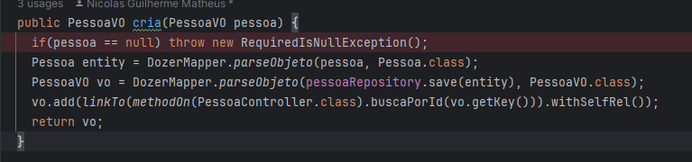

# Como testar exceptions?

- `[PROBLEMA]` primeiro vamos ao cenário, que é quando recebe uma pessoa como `null` ele lança uma `exception`
  - 
- `[SOLUÇÃO]`

  ```
  @Test
  void lancaExcessaoQuandoPessoaNull() {
    Exception exception = assertThrows(RequiredIsNullException.class, () -> {
      pessoaServices.cria(null);
    });

    String mensagemEsperada = "Não é permitido persistir um objeto nullo.";
    String mensagemAtual = exception.getMessage();

    assertEquals(mensagemEsperada, mensagemAtual);
  }
  ´´´
  ```
