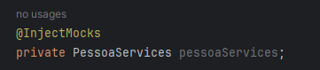
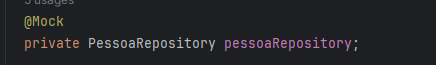

# Mockito

Um framework de testes que nos ajuda a mockar as coisas, tornando mais simples o dia dia.

## Como instalar?

1. adicione a dependencia ao maven
   ```
   <dependency>
     <groupId>org.mockito</groupId>
     <artifactId>mockito-core</artifactId>
     <scope>test</scope>
   </dependency>
   ```

<br>

---

<br>

### Anotações e seus significados

- `@InjectMocks`: Quando utilizamos InjectMocks, podemos injetar o nosso serviço dentro da nossa classe de testes.

  - 

- `@Mock`: oq você anotar com essa anotação será mockada, exemplo:
  - 
  - permitindo você realizar ações como:
    - `when(pessoaRepository.findById(pessoa.getId())).thenReturn(Optional.of(pessoa));`
  - sem ele você tomaria o erro:
    - `Cannot invoke "br.com.nicolas.repositories.PessoaRepository.findById(Object)" because "this.pessoaRepository" is null`

### asserts

- `Como verificar se o metodo foi chamado:`

  ```
  // Chamar o método que você quer testar
  minhaClasseMock.metodoAChamar();

  // Verificar se o método foi chamado
  verify(minhaClasseMock).metodoAChamar();
  ```
