# Lista de annotation em java.

1. `@RestController`: indica para o framework que se trata de um controlador Rest, voltado para o desenvolvimento de aplicações web Restful e facilita que nós lidemos com requisições web (POST, GET, PUT, etc) pois une o Controller a um ResponseBody para todos métodos marcados pelo RequestMapping. 
   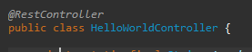

2. `@RequestMapping`: Tipos de parâmetros e significados:
   1. `path`: indica qual endpoint será
   2. `method`: qual verbo http esse metodo vai ter
   3. `produces`: indica qual `MediaType` esse endpoint vai `PRODUZIR/RETORNAR`, geralmente um `JSON` -> `MediaType.APPLICATION_JSON_VALUE`
   4. `consumes`: indica qual `MediaType` esse endpoint vai `RECEBER/CONSUMIR`, geralmente um `JSON` -> `MediaType.APPLICATION_JSON_VALUE`
   5. para se tornar um endpoint, você  precisa adicionar essa annotation passando o caminho do endpoint.
      1. endpoint sem parametros na url (path param)
      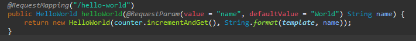

      2. Endpoint com parametros na url (path param)
      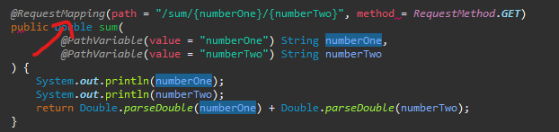

3. `@RequestParam`: para que o metodo receba parametros no endpoint vc deve utilizar essa annotation
    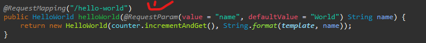

4. `@PathVariable`: recupera as variaveis declaradas dentro de `@RequestMapping` do exemplo `2.2`. 
   1. Segue exemplo: 
   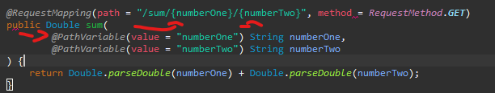
   
5. `@ResponseStatus`: diz o status que a classe irá retornar (400, 500, 200 e etc.)
   
6. `@ControllerAdvice`: ele funciona como um interceptor, no exemplo de tratamento de exceções, 
se colocado em um handler de exceções ele vai ser ativado toda vez que o código identificar que não existe um tratamento específico para aquela exceção vai cair na nossa exceção generica.

1. `@ExceptionHandler(Exception.class)`: Essa annotation filtra e diz para o metodo que está abaixo dela qual
   o tipo de exeção o metodo deve rodar a lógica dele nesse exemplo estou falando para que ele rode apenas 
   para exceções do tipo `Exception.class` significa que eu só quero que ele rode para exceções `GENÉRICAS`
   que na sua maioria são exceções do tipo erro 500, segue um exemplo de implementação dessa annotation.
   exemplo: 
   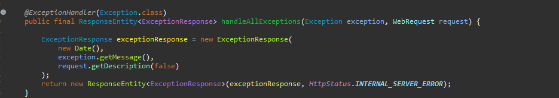

2. `@Service`: Indica para o spring boot que esse objeto será Injetado em RUN TIME em outras classes
   da nossa aplicação, segue exemplo:
   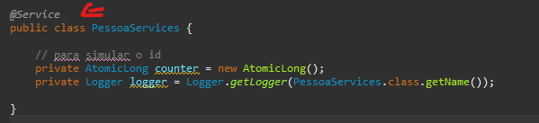

3. `@Autowired`: cuida da instaciação de uma classe de forma dinâmica em tempo de execução, segue exemplo em foto.
   1. Antigamente: 
      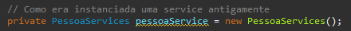
   2. Hoje em dia: 
      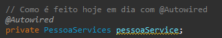
   3. Para que você consiga fazer isso com outras classes que não possuem a annotation `@Service`,
      essa classe deve possuir a annotation `@Component`, ou um Alias para ela, segue exemplo: 
      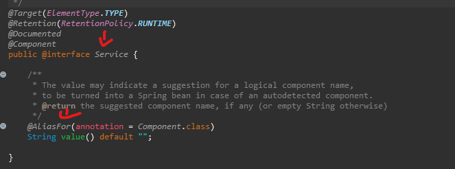 
      no exemplo acima só conseguimos utilizar `@Autowired` com `@Service` pq `@Service` tem um aliasFor `@Component`

4.  `@RequestBody`: é com ele que indicamos para o parâmetro do metodo que vamos receber um Body nesse metodo, segue exemplo: 
    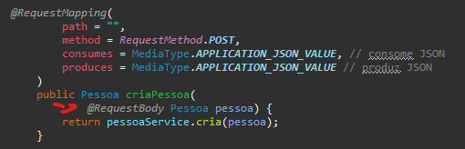
      

# Diferenças entre PathVariable e RequestParam

- `@RequestParam` você pode passar vários parâmetros no client que o endpoint não dará erro
- `@PathVariable` já com path, se você passar path não esperado pelo endpoint dará erro.
