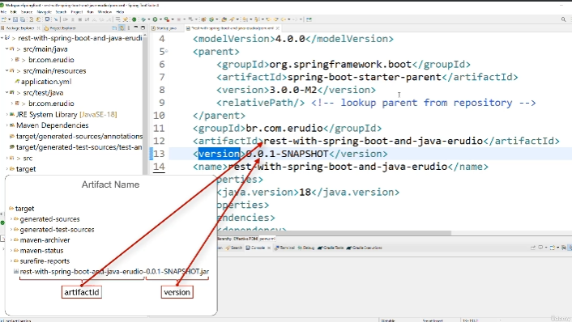
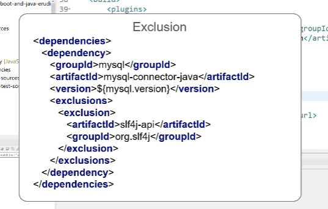

# JAVA

## Como instalar?

digite no google: `JAVA SE ORACLE NUMERO_DA_VERSAO_DESEJADA`

Vá até a pasta onde foi instalado o JAVA, geralmente: `C:\Program Files\Java` entre na pasta do jdk com a versao que escolheu e copie o path dela, exemplo: `C:\Program Files\Java\jdk-18.0.2.1`, você vai precisar dele para apontar esse path lá nas variaveis de ambiente do Windows

Vá até a barra de pesquisa do windows digite: `Editar as variaveis de embiente do sistema`, clique em `variaveis de ambiente` e adicione ou edite o JAVA_HOME as Variaveis de ambiente como no exemplo abaixo:

após isso cliente logo abaixo na variável Path depois clique no botão editar e caso não tenha adicione `%JAVA_HOME%\bin` ao `Path`

## Atalhos

1. `CTRL+SHIT+I` selecione o código em modo debug e aperta ele vai rodar apenas aquela linha, mas também pode ser um bloco e etc, importante só vai executar se o debugger já pasosu por ele.
2. `CTRL+SHIFT+R` busca classes
3. `CTRL+H` busca no workspace na tab file search você busca por uma string ou nome de classe funcção e etc igual no vs code na busca
4. `CTRL+ALT+H` vc seleciona o método e da esse comando ele vai buscar todos os lugares que estão chamando esse metodo

## Estrutura de pastas, como funciona?

- `src/main/resources`: Aqui geralmente guardamos recursos estaticos.
- `src/test/java`: Aqui adicionando os testes
- `target`: quando compilarmos o java, gera um .jar dentro dessa pasta
- `pom.xml`: aonde fica todas as dependencias do projeto (`package.json`)
  - `<modelVersion>`: a versao do pom
  - `<parent>`: é o pai, funciona como herança, quem está declarado em parent é o pai e o projeto que utiliza ele são os filhos
  - `groupId`: o identificador da estrutura de pacotes
  - `artifactId`: define o nome do artefato final
  - dentro do pom na raiz temos duas infos, essas duas infos que dão nome ao .jar gerado por nós, segue foto explicativa:
    
  - `name`: define o nome do projeto
  - `properties`: possibilita definir qual vai ser a versão do spring, do java e etc
    - `IMPORTANTE`: Se mudarmos o java.version de sla.. 18 para 17, mudaremos todo o pom, pois ele vai se atualizar com base no java 17 as suas dependencias.
  - `dependencies`: define quais são as dependencias do projeto
  - `build`: define como o projeto será compilado.
  - `repositories`: define a lista de repositórios que serão acessados pelo maven para baixar as nossas dependencias que definimos na tag `dependencie`.
  - `exclusion`: quando precisamos excluir uma dependencia já existente para nao ter conflitos, exemplo nosso spring boot ja usa a dependencia `slf4j-api` e o nosso mysql também, então em um dos dois devemos fazer a exclusão dessa dependencia para não causar conflitos.
    - exemplo em imagem:
      