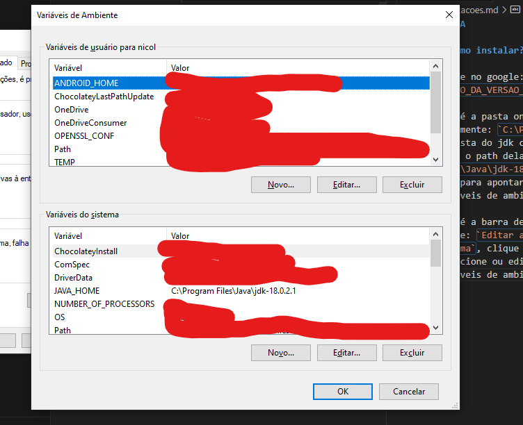

# JAVA

## Como instalar?

digite no google: `JAVA SE ORACLE NUMERO_DA_VERSAO_DESEJADA`

Vá até a pasta onde foi instalado o JAVA, geralmente: `C:\Program Files\Java` entre na pasta do jdk com a versao que escolheu e copie o path dela, exemplo: `C:\Program Files\Java\jdk-18.0.2.1`, você vai precisar dele para apontar esse path lá nas variaveis de ambiente do Windows

Vá até a barra de pesquisa do windows digite: `Editar as variaveis de embiente do sistema`, clique em `variaveis de ambiente` e adicione ou edite o JAVA_HOME as Variaveis de ambiente como no exemplo abaixo:

após isso cliente logo abaixo na variável Path depois clique no botão editar e caso não tenha adicione `%JAVA_HOME%\bin` ao `Path`

## Atalhos

1. `CTRL+SHIT+I` selecione o código em modo debug e aperta ele vai rodar apenas aquela linha, mas também pode ser um bloco e etc, importante só vai executar se o debugger já pasosu por ele.
2. `CTRL+SHIFT+R` busca classes
3. `CTRL+H` busca no workspace na tab file search você busca por uma string ou nome de classe funcção e etc igual no vs code na busca
4. `CTRL+ALT+H` vc seleciona o método e da esse comando ele vai buscar todos os lugares que estão chamando esse metodo