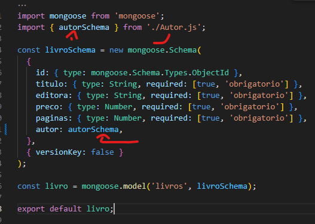
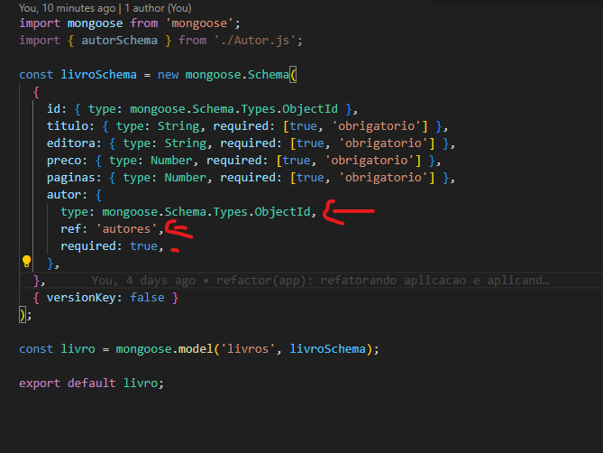
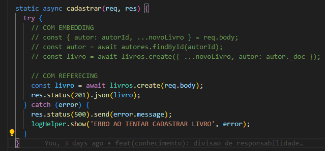
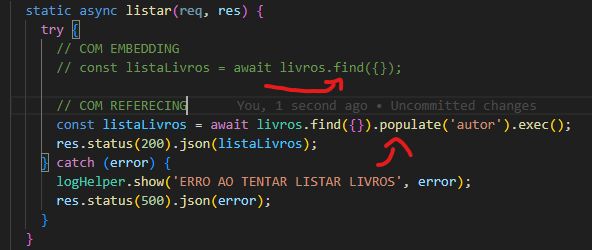
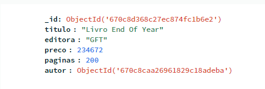
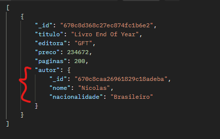

# Mongoose

## Tipos de relacionamento

- `embedding` utilizando essa abordagem eu INCORPORO o autor ao livro (mando o objeto todo do autor para dentro do livro)
  
- `referencing` utilizando essa abordagem eu REFERENCIO autores para o livro (mando apenas o id do autor dentro do livro)
  
- com `embedding` somos obrigados a, primeiro buscar o autor enviado no body, para ter o schema dele, e somente depois, podemos criar um livro baseado no que foi enviado de livro no body + o autor que pegamos no banco, isso deixa o código um pouco mais complexo, já utilizando `referencing` o código fica muito mais simplificado, pois ele vai armazenar exatamente como veio do body por referencia autor: '12kjdsa7213123'
  
- e por ultimo e não menos importante, a chamada para listar mudou, pois antes tinhamos o objeto todo de autor no banco, pois estavamos utilizando a estratégia `embedding`, agora que estamos utilizando a estratégia `referencing` temos que indicar para o mongoose pegar a referencia que tem no banco buscar ela na outra Collection de Autor e popular para nós.
  
- exemplo: no banco só tem o id do autor gravado para cada livro ( por conta do `referencing` )
  
- mas no get ele retorna o autor todo, justamente pq estamos pedingo para ele popular o autor INCLUSIVE.
  
