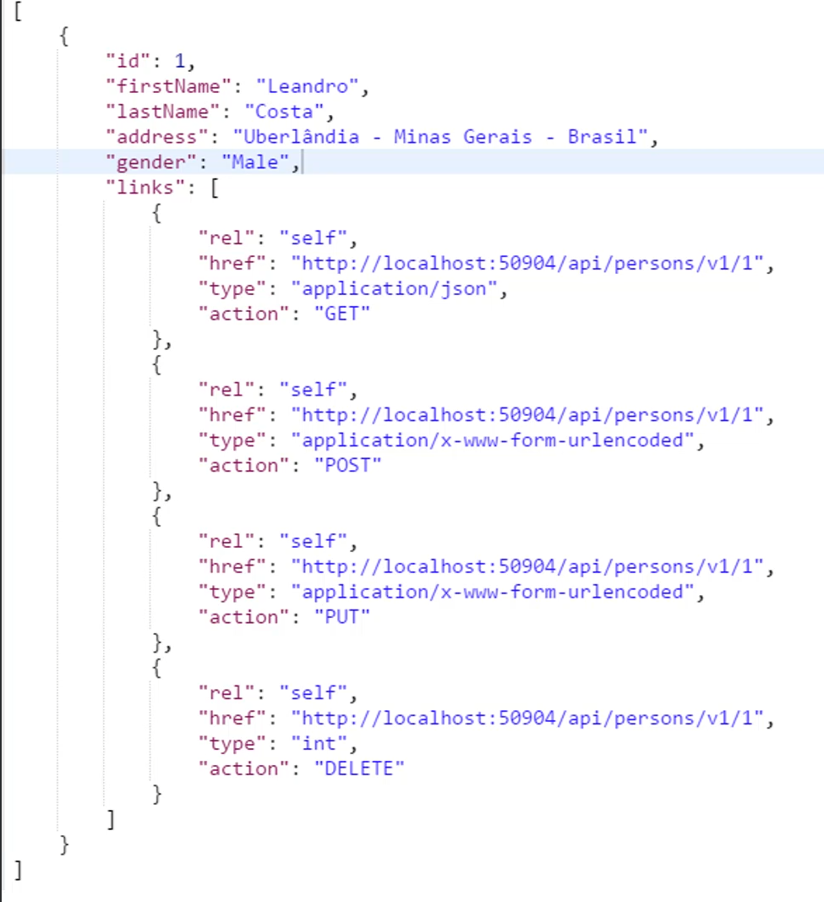

# REST ( Representational State Transfer )

## REST 6 Constraints ( restrições )

1. Cliente-servidor
   1. Cliente e servidores devem estar separados
2. Stateless Server
   1. O servidor não deve guardar o estado do cliente. Cada request de um cliente contém todas as informações necessárias para que a requisição seja processada por completo.
3. Cacheable
   1. O cliente deve ser informado sobre as propriedades de cache de um recurso para que possa decidir quando deve ou não utilizar cache.
4. Interface uniforme
   1. Existe uma interface uniforme entre cliente e servidor
      1. Identificação de recursos (URI).
      2. Manipulação de recursos a partir de suas representações.
      3. Mensagens auto descritivas
      4. HATEOAS ( Hyper media as the engine of application state )
5. Sistema em camadas
   1. Deve suportar conceitos como balanceamento de carga, proxies e firewalls.
   2. Exemplo: entre uma API e os Clients deve ser possível colocar coisas como balanceamento de carga, firewalls e etc, e isso deve ser transparente
6. Código Sob Demanada (opcional)
   1. O cliente pode solicitar o código do servidor e executá-lo

## Tipos de parâmetros

- Path Params (passagem obrigatória) exemplo:
  - https://your_host/api/books/v1/find-users/asc/10/1
  - no exemplo acima, eu OBRIGATÓRIAMENTE preciso passar "asc"
    "10" e  "1" como path param.

- Query Params ( passagem opcional )
  - https://your_host/api/books/v1/find-users?oder=asc&pageSize=10&pageNumber=1
  - Já nos query params é opcional a passagem, e muito mais legivel nesse caso.

- Header Params
  - Onde configuramos algumas informações
  - `Accept`: Dizemos que tipo aceitamos "text/plain", "application/json" e etc.
  - `Content-Type`: sinaliza para o client qual o tipo de response ele vai receber

- Body
  - existem varios formatos que o CLIENT pode enviar os dados:
    - `form-data`
    - `raw`
    - `binary`
    - `GraphQL`
    - dentre outros

## HTTP Status Code

- `1xx` Informacionais
- `2xx` Sucesso
- `3xx` Redirecionamento
- `4xx` Erro de Client
- `5xx` Erro de Server

## 2xx mais utilizados

- `200` OK
  - Requisição processada com sucesso
- `201` Created
  - Requisição processada com sucesso e um ou mais recursos foram criados com sucesso.
- `202` Accepted
- `204` No Content

## 4xx mais utilizados

- `400` Bad Request
  - O servidor não vai processar a requisição por um erro nas informações enviadas pelo cliente. Uma URL mal formada ou dados inválidos são alguns exemplos.
- `401` Unauthorized
  - O cliente não forneceu as credenciais corretas para acessar o recurso.
- `403` Forbidden
  - O servidor recebeu a requisição, mas se negou a autorizá-la.
- `404` Not Found
  - O servidor não encontrou uma representação atual do recurso solicitado.

## 5xx mais utilizados

- `500` Internal Server Error
  - Quando o CLIENT manda uma requisição para uma operação que não existe.
- `401` Unauthorized
  - Quando o CLIENT faz uma requisição para um endpoint que ele não tem autorização
- `403` Forbidden
  - Quando o CLIENT não tem permissão em um endpoint
- `404` Not Found
  - retornado quando o endereço não é encontrado

# Verbos HTTP ( GET, POST, PUT, PATCH, DELETE )

1. GET
   1. Parametros suportados
      1. Via URL (PATH ou QUERY PARAMS)
      2. Via HEADER
      3. UNICO VERBO QUE NÃO ACEITA PARAMETROS VIA BODY
2. POST
   1. Cria novos recursos
   2. status code utilizado 200 ou 201
   3. Parametros suportados
      1. Via URL (PATH ou QUERY PARAMS)
      2. Via HEADER
      3. Via Body
3. PUT
   1. Atualiza recursos existentes na base
   2. status code utilizado 200 ou 204 ( 204 apenas se você não retornar nada para o client )
   3. Parametros suportados
      1. Via URL (PATH ou QUERY PARAMS)
      2. Via HEADER
      3. Via Body
4. DELTE
   1. Deleta recursos existentes na base
   2. status code utilizado 200 ou 204 ( 204 apenas se você não retornar nada para o client )
   3. status 200, voce retornaria um response body o item deletado possivelmente, mas não é tão interessante por demandar muita banda.
   4. status 204 sem response no body
   5. Parametros suportados
      1. Via URL (PATH ou QUERY PARAMS)
      2. Via HEADER
      3. Via Body
5. PATCH
   1. Atualiza recursos existentes na base
   2. utilizar patch é interessante em alguns casos para economizar recursos de banda, por exemplo em uma empresa eu tenho um endpoint que recebo 80campos de formulário, ai não seria interessante passar os 80 campos em um put para atualizar apenas 1 campo, ai que entra o PATCH que o usuário vai passar apenas o id e o(s) campo(s) a serem atualizados
   3. status code utilizado 200 ou 204 ( 204 apenas se você não retornar nada para o client )
   4. Parametros suportados
      1. Via URL (PATH ou QUERY PARAMS)
      2. Via HEADER
      3. Via Body

## Niveis de maturidade do REST

> Para a sua API ser considerada uma API RESTFul ela precisa atender a no mínimo 4 leveis teorizados pelo Leonard Richardson

- `Level 0`: Tenho um unico endpoint e ele gerencia tudo, grava chamado, cadastra cliente, lida com xml, e etc, usa http para trafegar JSON ou XML
- `Level 1`: está organizado por recursos, seguindo o exemplo do `Level 0` agora ao invés de ter um endpoint que faz tudo, eu tenho um endpoint para cada tipo de recurso, /grava-chamado, /cadastra-cliente e por ai vai.
- `Level 2`: Passa a utilizar Verbos Http (GET, POST, PUT, DELETE)
- `Level 3`: Uso de Hypermedia Controls ou HATEOAS, é quando a sua API fornece links e apartir desse link você pode fazer outra requisição, segue exemplo: 

- `Glory of Rest`: acima desses níveis é a glória do rest.
- `EXEMPLOS DE GLORY OF REST`: Documentar API's com swagger, é um plus muito necessário, facilita a vida de todos, e mantemos uma documentaçao sobre a API

## HATEOS

`H`ypermedia `A`s `T`he `E`ngine `O`f `A`pplication `S`tate (`HATEOAS`)

Permite navegar entre os seus endpoints de forma dinâmica, visto que inclui links junto as respostas.