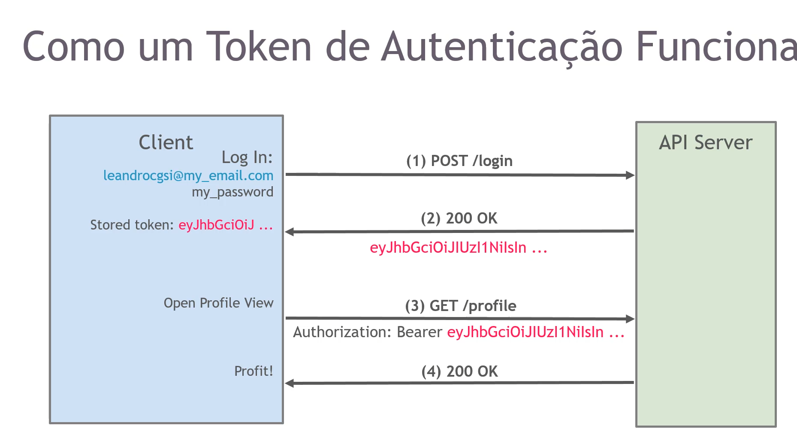
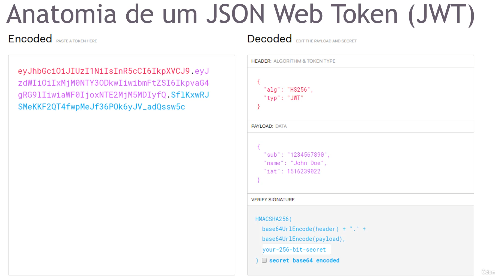

# JWT

Json Web Token

# Como um token de autenticação funciona?

Segue imagem de exemplo:

# Anatomia de um JSON Web Token (JWT)

O token é separado por pontos os seus códigos, então podemos ver que cada parte do token possui uma cor

`COR VERMELHA`: Representa o header
`COR ROXA`: Representa o PAYLOAD
`COR AZUL`: Representa a ASSINATURA (SIGNATURE) é ela que define se o token É ou NÃO valido.
