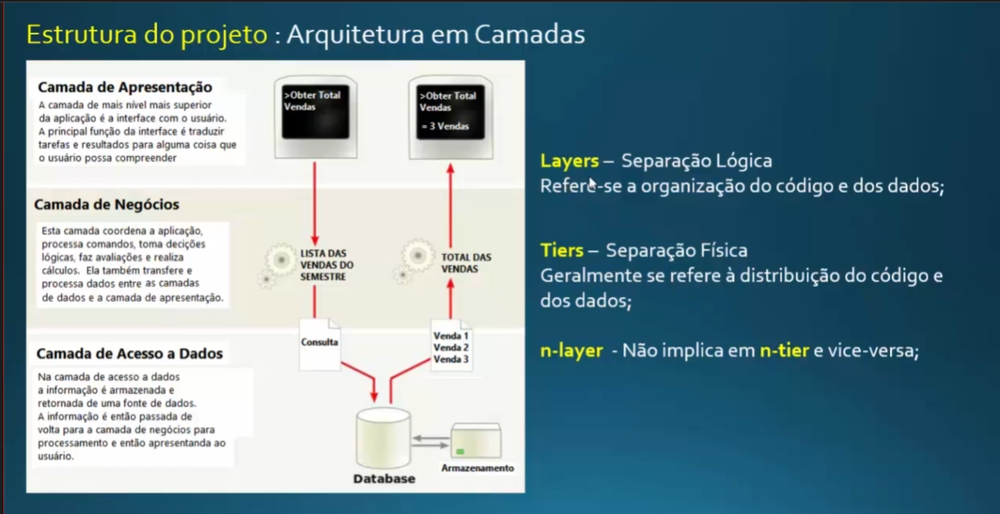

# Boas práticas em C#

Padrão:
- Repository / Repositório -> 

Boas Práticas:
- Nome das Controllers no plural -> UsuariosController
- Nome dos endpoints no plural -> v1/api/usuarios -> v1/api/usuarios/1

Arquitetura do Projeto:
- Estrutura em camadas: 
- - Camada de Apresentação -> Aqui é a camada que o usuário tem de conversa com a aplicação, Exemplo: Obter Total Vendas
- - Camada de Negócios -> Aqui se concentra toda a lógica de negócio da aplicação
- - Camada de Acesso a Dados -> Aqui é a consulta no banco de dados

Exemplo de toda essa arquitetura em imagem:
