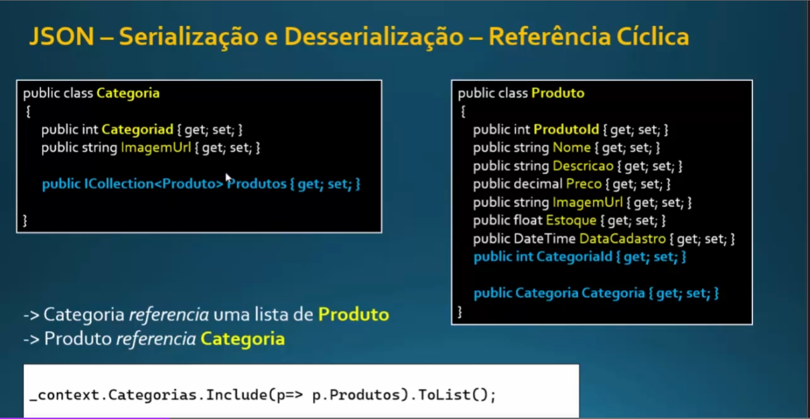

# Lista com Erros e soluções

1. `System.Text.Json.JsonException: A possible object cycle was detected. This can either be due to a cycle`
  <br>Esse erro ocorre pois... Exemplo minha `Entidade Categoria` referencia `Produto` e `Produto Referência Categoria`,
  <br>Então no `tratamento do JSON`, isso causa um `erro de referencia Ciclica entre as entidades`
  <br>E para resolvermos isso devemos `ignorar o objeto que causa referencia ciclica` com o seguinte código:
    ```
    builder.Services.AddControllers().AddJsonOptions(options =>
    {
      options.JsonSerializerOptions.ReferenceHandler = ReferenceHandler.IgnoreCycles;
      // Utilizamos a classe ReferenceHandler para dizer como o JsonSerializer vai lider com as referencias
      // na Serialização e Desserialização
      // e ai eu to chamando a propriedade IgnoreCycles que vai ignorar as referencias no momento de Serealização
    });
    ```
