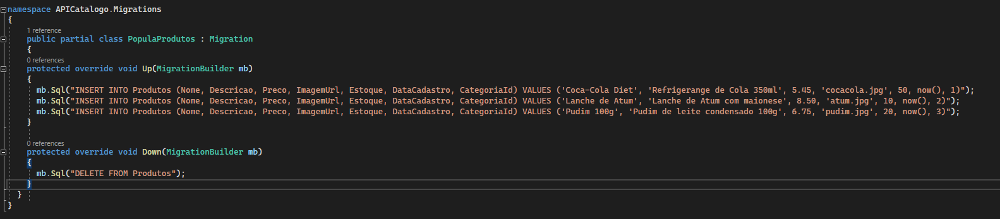

# Maneiras mais faceis de popular dados

1. Você pode clicar com o direito na tabela E ou coluna ir em `Send to SQL Editor` e escolher a opção que vc qr,  
por exemplo... `Insert Statement`, ai ele vai gerar um script de insert com base na tabela ou coluna que você clicou.

2. Criar usando o método `OnModelCreating` do arquivo de contexto e definir o código usando a propriedade `HasData`
do EF Core para preencher as tabelas com dados.

3. Criar um método estático e definir o código para incluir dados usando o método `AddRange()` do EF Core

4. Criar uma migração vazia usando o `Migrations` e usar os métodos `Up() e Down()` definindo nestes
métodos as instruções `INSERT INTO`  para  incluir dados nas tabelas.
> Uma migração VAZIA significa que a ultima migração vc já executou e dps disso você não alterou nada no dbContext nem nas suas entitys e vai rodar o comando de migrations novamente, ai ele cria uma migração vazia apenas com os metodos Up e Down 

> Após feito o passo acima, você consegue criar seu próprio script segue exemplo abaixo:

