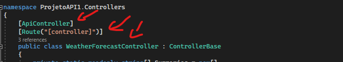

# Controller

### Alguns pontos sobre controlers



- ```[ApiController]``` -> é um decorator que habilita
a classe abaixo a ser uma controller, e habilita alguns recursos, como:
  1. Requisito de roteamento de atributo
  2. Respostas HTTP 400 Automáticas `( Validação do Model State )`
  3. Inferência de parâmetro de origem de associação
  4. Inferência de solicitação de dados de várias partes/formulário
  5. Uso de `Problem Details` para códigos de status de erro

- ```[Route("[controller]")]``` -> aqui definimos o nome da rota, quando inserimos controller significa que queremos que o nome da nossa classe seja o nome da controller ou seja se eu fizer algo como: <br/> 
```
  [ApiController]
  [Route("[controller]")]
  public class PessoaController : ControllerBase
```
o nome da nossa rota será /pessoa

- ```[Route("nome_personalizado")]``` -> dessa forma o nome da nossa rota passa a ser ```/nome_personalizado``` independente do nome da Controller

- ```ControllerBase``` -> É a classe base onde fornece muitas propriedades e métodos que servem para lider com as requisições HTTP.<br>
  Exemplos:

  1. BadRequest() -> Retorna o status 400
  2. NotFound() -> Retorna o status 404
  3. CreatedAtAction() -> Retorna o status 201
  4. PhysicalFile() -> Retorna um arquivo
  5. TryValidationModel -> Invoca a validação do modelo
  6. Ok() -> Retorna o status 200
   

