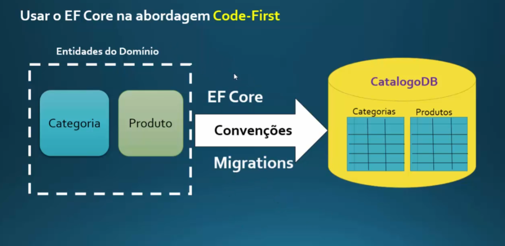

# Entity Framework ( EF )

## Como ele identifica um id?

Para ele identificar um Id, existe duas formas, podemos declarar a classe com o NOME_DA_CLASSEId ou apenas Id,
Segue Exemplos:

Com nome da classe:
```
public class Categoria
{
  public int CategoriaId { get; set; }
}
```


Sem:
```
public class Categoria
{
  public int Id { get; set; }
}
```

Ambos os casos o EF consegue identificar e criar pra gente o id na tabela.

## Abordagem Code-First

Ela basicamente diz que devemos primeiro criar nossas endidades de dominio ( classes como Produto e suas props )
e depois fazer a relação com o banco de dados

