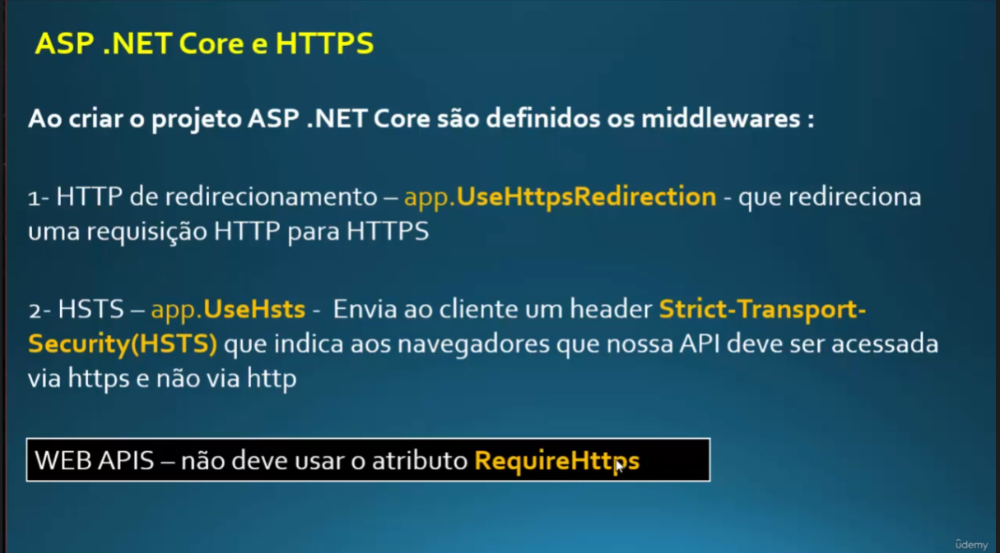

# .NET Middlewares

É muito importante mantermos nossa aplicação segura, então devemos recusar requisições feitas em http com o UseHttpsRedirecion e impedir que usuários consigam acessar nossa api via http com o recurso Use.Hsts

app.UseHttpsRedirection Podemos utilizar esse middleware para redirecionar uma requisição feita em http para https para tornar o ambiente mais seguro.

app.Use.Hsts Aqui nós empedimos que usuários acessem nossa api via HTTP

