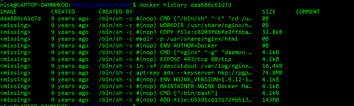
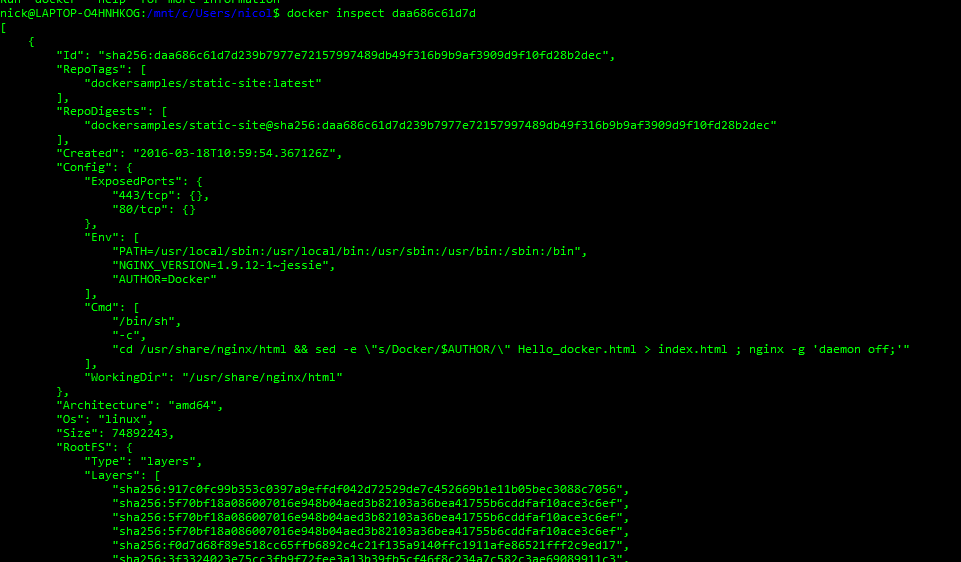
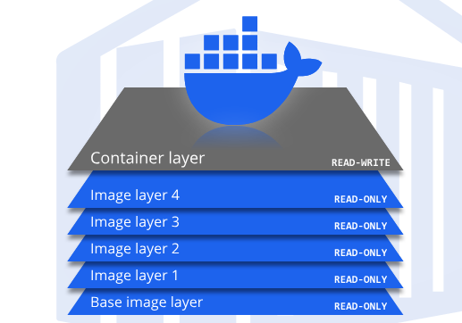
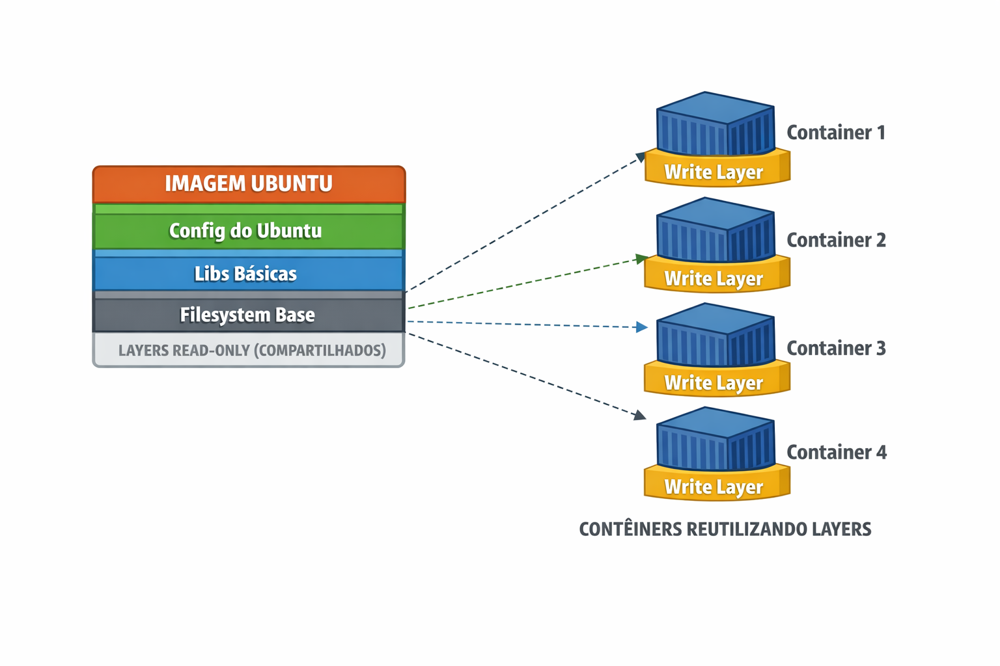

Link REF: https://www.youtube.com/watch?v=F2au3FXq9Y4

lista de comandos docker

- `docker --helper` -> para verificar se o seu docker está instalado na maquina
- `docker run hello-world` -> para verificar se o seu docker desktop está de pé
- `docker build -t angular-docker .`
  - `docker build`: Comando usado para construir uma imagem Docker.
  - `-t angular-docker`: A opção `-t` permite atribuir uma tag (ou nome) à imagem que está sendo construída. Neste caso, a imagem será nomeada como angular-docker
  - `.` o ponto no final é para falar para o docker que o arquivo Dockerfile está na raiz aonde o comando está sendo executado
- `docker run -p 4500:4500 angular-docker`
  - `docker run`: Comando para iniciar um novo contêiner a partir de uma imagem Docker.
  - `-p 4500:4500`: Opção para mapear portas entre o host e o contêiner.
    - `4500:4500`: O formato é porta_host:porta_contêiner. Isso significa que a porta 4500 do host será redirecionada para a porta 4500 dentro do contêiner.
  - `angular-docker`: Nome ou tag da imagem Docker que será usada para criar o contêiner. Essa imagem deve ter sido previamente construída ou baixada.
- `docker ps`: lista todos os containers ativos
- `docker pull [NOME_DA_SUA_IMAGEM]`: ele baixa a imagem apenas.
- `docker run [NOME_DA_SUA_IMAGEM]`: ele baixa a imagem e sobe um docker
- `docker exec -it [ID_CONTAINER] bash`: ele entra nesse docker em modo interativo ( você fica dentro desse container podendo executar comandos dentro dele )
-  `docker stop ID_DO_SEU_CONTAINER`: faz com que o container pare de rodar, ele RESETA toda a arvore de processos que estavam em execução.
-  `docker pause ID_DO_SEU_CONTAINER`: faz com que o container pare de rodar, porem ele NÃO RESETA a arvore de processos, os processos continuam rodando.
-  `docker unpause ID_DO_SEU_CONTAINER`: faz o seu container voltar a rodar.
-  `docker run [IMAGEM]`: ela roda sua image, porem se vc ficar rodando ele vai criar 1 instancia para cada docker run.
-  `docker start [ID_CONTAINER]`: se voce deu um stop, voce pode dar um start pelo id do container que o container volta a subir e reexecutar tudo que estava programado.
-  `top`: não é comando docker, é linux, mas é util pois ele verifica todos os processos que estão sendo executados
-  `docker stop -t=0 [ID_CONTAINER]`: o -t=0 diz que eu nao quero esperando 10 segundos, para que meu container pare.
-  `docker rm [ID_CONTAINER]`: remove o container ( e tudo que estava dentro dele é perdido ), exemplo: se você criou um arquivo x la dentro, esse arquivo é perdido.
-  `docker images`: lista todas as imagens que você já baixou
-  `docker rmi [ID_DA_SUA_IMAGEM]`: remove a imagem que você baixou anteriormente.
-  `docker run -P [ID_CONTAINER]`: faz o mapeamento automatico de portas pra você
-  `docker run -p 80:80 [ID_CONTAINER]`: faz o mapeamento MANUAL de portas, sendo que PORTA_DA_SUA_MAQUINA_LOCAL:PORTA_DO_CONTAINER, ex: o container ao ser executado ele fica escutando a porta 80, localmente você quer que quando acessar localhost:3000 ele aponte para a porta 80 do seu container, entao a configuração deve ser `docker run -p 3000:80 [ID_CONTAINER]` ai quando você acessar localhost:3000 ele vai redirecionar você para dentro do container na porta 80
-  `docker port [ID_CONTAINER]`: mostra todo o mapeamento de portas do seu container
-  `docker history [ID_IMAGEM]`: mostra todos os layers dessa imagem
   - 
-  `docker inspect [ID_IMAGEM]`: mostra toda a configuração feita para essa imagem
   -  
-  `docker build -t spyrado/app-node:1.0 .`: esse comando vai:
   - rodar um build para construir uma imagem docker
   - `-t` indica qual o nome que eu quero dar para essa imagem 
   - `spyrado/app-node` representa o nome da imagem
   - `:1.0` é a versao que eu estou dando para essa imagem 
   - o `.` do final representa qual o caminho que essa instrução deve ser executada, como geralmente rodamos a instrução na mesma pasta onde se encontra o dockerfile, colocamos o `.` para indicar que é para rodar ali mesmo aonde estamos.

## COISAS INTERESSANTES

> docker stop [ID_CONTAINER] // ele vai matar os processos que estão rodando, **MANTEM OS ARQUIVOS CRIADOS** \
> docker start [ID_CONTAINER] // ele vai iniciar do zero os processos 

> docker pause [ID_CONTAINER] // ele vai congelar o seu container e NÃO VAI matar os processos que estão rodando **MANTEM OS ARQUIVOS CRIADOS** \
> docker unpause [ID_CONTAINER] // ele vai despausar o seu container, e seus processos vão continuar lá

 
> docker rm [ID_CONTAINER] // ele vai deletar o seu container **DELETA OS ARQUIVOS CRIADOS**, ao rodar outra instancia, vai estar sem os arquivos previamente configurados ( em caso de inserção manual )

## COISAS INTERESSANTES

### CAMADAS DO DOCKER (DOCKER LAYERS)




Duvidas frequentes: **NÃO**, o Docker **não baixa nem duplica os layers** para cada container.

Agora vamos ao detalhe 👇

## 🧱 Como o Docker usa layers

O Docker trabalha com **imagens em camadas (layers)** e **containers reutilizam essas camadas**.

Exemplo simplificado da imagem Ubuntu:

- Layer 1: filesystem base  
- Layer 2: libs básicas  
- Layer 3: configs do Ubuntu  

Esses layers:

- São baixados **UMA ÚNICA VEZ**
- Ficam armazenados localmente
- São **read-only**

## 📦 E se eu criar 7 containers Ubuntu?

Se você rodar:

```bash
docker run ubuntu
docker run ubuntu
docker run ubuntu
```

- 👉 O que acontece:
  - ✅ Download do Ubuntu: apenas 1 vez
  - ✅ Layers compartilhados entre todos os containers
  - ❌ Não duplica espaço em disco
  - ❌ Não cria 7 cópias da imagem

- Cada container cria apenas:
  - mais 1 camada extra (write layer)

