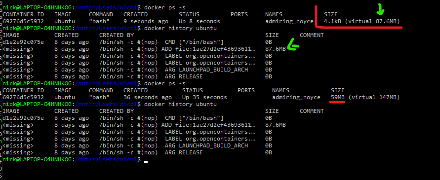
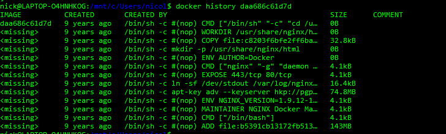
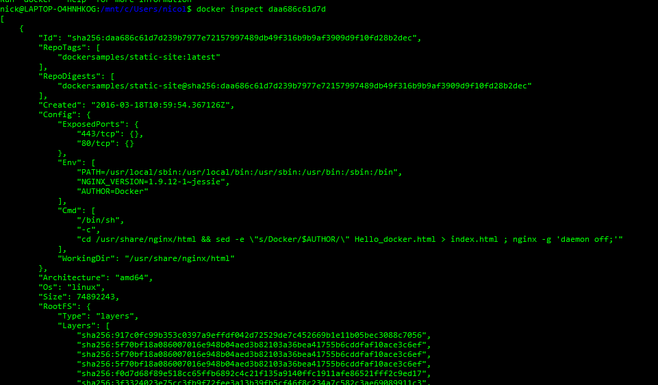
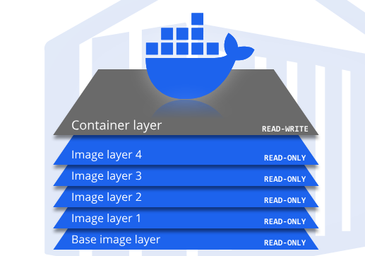
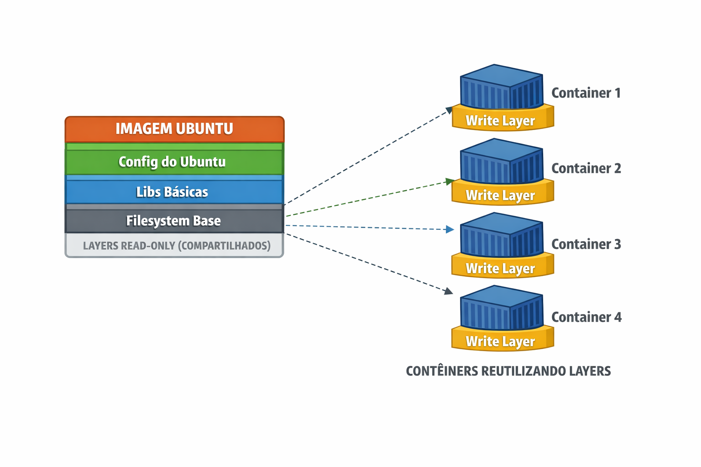

Link REF: https://www.youtube.com/watch?v=F2au3FXq9Y4

lista de comandos docker

- `docker login -u nome_do_seu_usuario_no_docker` -> exemplo: docker login -u spyrado, e depois voce coloca sua senha
- `docker --helper` -> para verificar se o seu docker está instalado na maquina
- `docker run hello-world` -> para verificar se o seu docker desktop está de pé
- `docker build -t angular-docker .`
  - `docker build`: Comando usado para construir uma imagem Docker.
  - `-t angular-docker`: A opção `-t` permite atribuir uma tag (ou nome) à imagem que está sendo construída. Neste caso, a imagem será nomeada como angular-docker
  - `.` o ponto no final é para falar para o docker que o arquivo Dockerfile está na raiz aonde o comando está sendo executado
- `docker push nome_da_sua_imagem` -> exemplo: spyrado/mfe-login:1.0.0
- `docker run -p 4500:4500 angular-docker`
  - `docker run`: Comando para iniciar um novo contêiner a partir de uma imagem Docker.
  - `-p 4500:4500`: Opção para mapear portas entre o host e o contêiner.
    - `4500:4500`: O formato é porta_host:porta_contêiner. Isso significa que a porta 4500 do host será redirecionada para a porta 4500 dentro do contêiner.
  - `angular-docker`: Nome ou tag da imagem Docker que será usada para criar o contêiner. Essa imagem deve ter sido previamente construída ou baixada.
- `docker ps`: lista todos os containers ativos
- `docker ps -a`: lista todos os containers inativos
- `docker ps -s`: lista os containers e mostra o size de cada um deles, e todo container tem o size inicial dele proprio
  - exemplo: ubuntu tem 87.6MB de size padrão, e 0mb de size de RW(Read Write)
  - se eu subir o container do ubuntu e rodar o comando apt-get update
  - e rodar novamente o docker ps -s, o size do ubuntu vai subir de 87.6MB para valor XPTO ( ex: 150mb ) pois ele fez um update na maquina e isso escreveu atualizações naquele container, ou seja o seu tamanho aumentou.
  - e vale lembrar que sempre que deletamos o container do ubuntu e subimos ele novamente tudo que existia se perde, pois o docker é Efêmero
    - Quer dizer que:
      - O container pode ser destruído a qualquer momento
      - O estado interno não é confiável
      - Mudanças feitas dentro dele são descartáveis
  - 
- `docker pull [NOME_DA_SUA_IMAGEM]`: ele baixa a imagem apenas.
- `docker run [NOME_DA_SUA_IMAGEM]`: ele baixa a imagem e sobe um docker
- `docker exec -it [ID_CONTAINER] bash`: ele entra nesse docker em modo interativo ( você fica dentro desse container podendo executar comandos dentro dele )
- `docker stop $(docker ps -q)`: para todos os containers em execução
- `docker stop ID_DO_SEU_CONTAINER`: faz com que o container pare de rodar, ele RESETA toda a arvore de processos que estavam em execução.
- `docker stop -t=0 [ID_CONTAINER]`: o -t=0 diz que eu nao quero esperando 10 segundos, para que meu container pare.
- `docker pause ID_DO_SEU_CONTAINER`: faz com que o container pare de rodar, porem ele NÃO RESETA a arvore de processos, os processos continuam rodando.
- `docker unpause ID_DO_SEU_CONTAINER`: faz o seu container voltar a rodar.
- `docker run [IMAGEM]`: ela roda sua image, porem se vc ficar rodando ele vai criar 1 instancia para cada docker run.
- `docker start [ID_CONTAINER]`: se voce deu um stop, voce pode dar um start pelo id do container que o container volta a subir e reexecutar tudo que estava programado.
- `top`: não é comando docker, é linux, mas é util pois ele verifica todos os processos que estão sendo executados
- `docker rm [ID_CONTAINER]`: remove o container ( e tudo que estava dentro dele é perdido ), exemplo: se você criou um arquivo x la dentro, esse arquivo é perdido.
- `docker container rm $(docker container ls -aq)`: remove todos os containers tanto os ativos, quanto os parados (-a)
    - docker container rm -> remove container e vc indica qual
    - $(docker container ls -aq) comando para indicar que eu quero remover todos os container ativos e inativos
-  `docker rmi $(docker image ls -aq)`: remove todas as imagens docker
-  `docker images`: lista todas as imagens que você já baixou
-  `docker rmi [ID_DA_SUA_IMAGEM]`: remove a imagem que você baixou anteriormente.
-  `docker run -P [ID_CONTAINER]`: faz o mapeamento automatico de portas pra você
-  `docker run -p 80:80 [ID_CONTAINER]`: faz o mapeamento MANUAL de portas, sendo que PORTA_DA_SUA_MAQUINA_LOCAL:PORTA_DO_CONTAINER, ex: o container ao ser executado ele fica escutando a porta 80, localmente você quer que quando acessar localhost:3000 ele aponte para a porta 80 do seu container, entao a configuração deve ser `docker run -p 3000:80 [ID_CONTAINER]` ai quando você acessar localhost:3000 ele vai redirecionar você para dentro do container na porta 80
-  `docker port [ID_CONTAINER]`: mostra todo o mapeamento de portas do seu container
-  `docker history [ID_IMAGEM]`: mostra todos os layers dessa imagem
   - 
-  `docker inspect [ID_IMAGEM]`: mostra toda a configuração feita para essa imagem
   -  
-  `docker build -t spyrado/app-node:1.0 .`: esse comando vai:
   - rodar um build para construir uma imagem docker
   - `-t` indica qual o nome que eu quero dar para essa imagem 
   - `spyrado/app-node` representa o nome da imagem
   - `:1.0` é a versao que eu estou dando para essa imagem 
   - o `.` do final representa qual o caminho que essa instrução deve ser executada, como geralmente rodamos a instrução na mesma pasta onde se encontra o dockerfile, colocamos o `.` para indicar que é para rodar ali mesmo aonde estamos.
-  `docker volume ls`: lista os volumes já criados.
-  `docker volume create meu-volume`: cria um volume chamado "meu-volume"

# VOLUMES

> Podemos compartilhar volumes `ENTRE CONTAINERS`

## BIND MOUNTS

  ### adicionando volumes com a flag -v

  - `docker run -it -v /caminho/xpto/volume-docker-pasta-teste:/app ubuntu bash`: aqui eu estou rodando um comando que faz com que dentro do ubuntu tenha uma pasta chamada app e tudo que tenha localmente na minha maquina 
    dentro da pasta /volume-docker-pasta-teste automaticamente vai para dentro do ubunto na pasta /app.
  - `docker run -it` estou pedindo para o docker rodar ALGO ( que eu n falei ainda ) em modo iterativo.
  - `-v /caminho/xpto/volume-docker-pasta-teste:/app` estou indicando que vai ter um volume e esse volume está localizado na minha maquina local no caminho x na pasta /volume-docker-pasta-teste, e que é para passar tudo que tem nessa pasta para a pasta /app
    que fica dentro do ubuntu
  - `ubuntu bash`: no final eu digo para rodar ubuntu em bash
  - `OBSERVAÇÃO`: é uma via de mao dupla, ao startar ele pega oq tem na pasta /volume-docker-pasta-teste porem se durante o "running" do container ele criar algo dentro da pasta /app, ele via passar esse mesmo algo para a pasta /volume-docker-pasta-teste para que
      sempre ambos fiquem atualizados.
  - `VANTAGEM DESSA ABORDAGEM:` toda vez que eu stopo ou deleto o pod e rodar ele com o comando indicando o volume, ele sempre vai iniciar novamente já com o volume que tinha antes, assim não perdemos dados.

  ### adicionando volumes com a flag --amount ( mais recomendada )
    - `docker run -it --mount type=bind,src=/caminho/xpto/volume-docker-pasta-teste,target=/app ubuntu bash`: aqui é a mesma coisa que o exemplo do -v, porem o docker recomenda utilizar o --mount por ficar mais explicito e ter mais compatibilidade

## VOLUME 

> CRIANDO volume e fazendo o docker em vez de pegar local via bind pegar do volume criado

   -  `docker volume ls`: lista os volumes já criados.
   -  `docker volume create meu-volume`: cria um volume chamado "meu-volume"
   -  `docker run -it --mount src=meu-volume,target=/app ubuntu bash` ou `docker run -it -v meu-volume:/app ubuntu bash` ambos vao apontar para a pasta que foi criada no docker chamada de "meu-volume" e sempre que for recuperar será de lá.
   `DUVIDA`, e aonde fica esse volume?
    dentro desse caminho: `/var/lib/docker/volumes`, para acessar precisa acessar com sudo su ( super usuário )
    o conteudo sempre vai ficar aqui `/var/lib/docker/volumes/meu-volume/_data`
   `DICA IMPORTANTE` se voce rodar esse comando: `docker run -it --mount src=meu-volume,target=/app ubuntu bash` porem não existir o volume "meu-volume" criado ainda, ele vai `CRIAR` para voce automaticamente.

## tmpfs

> DIFERENTE dos volumes e os bind mounts você NÃO CONSEGUE compartilha-los entre containers

> Essa funcionalidade está `APENAS DISPONÍVEL` se você estiver rodando dentro de um `linux`

> tmpfs não é armazenado na camada de RW (Read Write), pois ele é armazenado na MEMORIA RAM do HOST

  ### Quais são as vantagens?
    🔹 1. Performance (muito mais rápido)

    RAM é **MUITO** mais rápida que disco.

    👉 Ideal pra:
    - arquivos temporários  
    - cache  
    - processamento intermediário  

    ---

    🔹 2. Segurança 🔐

    Nada é persistido.

    👉 Perfeito pra:
    - senhas temporárias  
    - tokens  
    - dados sensíveis  

    Se o container parar → **sumiu tudo**

    ---

    🔹 3. Evitar escrita em disco

    Às vezes você não quer sujar o disco.

    👉 Exemplo:
    - logs temporários  
    - arquivos que não precisam ser salvos  


## Global Option

> cada COMANDO tem um leque de opções, para visualiza basta:
> docker COMMAND --help
> exemplo, quero saber sobre as opções de um RUN ai eu tenho que fazer
> docker run --help ele vai me listar todas as opções que docker run tem.

- `-d`: detached mode, o terminal fica livre e o container continua rodando.

## COISAS INTERESSANTES

> docker stop [ID_CONTAINER] // ele vai matar os processos que estão rodando, **MANTEM OS ARQUIVOS CRIADOS** \
> docker start [ID_CONTAINER] // ele vai iniciar do zero os processos 

> docker pause [ID_CONTAINER] // ele vai congelar o seu container e NÃO VAI matar os processos que estão rodando **MANTEM OS ARQUIVOS CRIADOS** \
> docker unpause [ID_CONTAINER] // ele vai despausar o seu container, e seus processos vão continuar lá

 
> docker rm [ID_CONTAINER] // ele vai deletar o seu container **DELETA OS ARQUIVOS CRIADOS**, ao rodar outra instancia, vai estar sem os arquivos previamente configurados ( em caso de inserção manual )

## COISAS INTERESSANTES

### CAMADAS DO DOCKER (DOCKER LAYERS)




Duvidas frequentes: **NÃO**, o Docker **não baixa nem duplica os layers** para cada container.

Agora vamos ao detalhe 👇

## 🧱 Como o Docker usa layers

O Docker trabalha com **imagens em camadas (layers)** e **containers reutilizam essas camadas**.

Exemplo simplificado da imagem Ubuntu:

- Layer 1: filesystem base  
- Layer 2: libs básicas  
- Layer 3: configs do Ubuntu  

Esses layers:

- São baixados **UMA ÚNICA VEZ**
- Ficam armazenados localmente
- São **read-only**

## 📦 E se eu criar 7 containers Ubuntu?

Se você rodar:

```bash
docker run ubuntu
docker run ubuntu
docker run ubuntu
```

- 👉 O que acontece:
  - ✅ Download do Ubuntu: apenas 1 vez
  - ✅ Layers compartilhados entre todos os containers
  - ❌ Não duplica espaço em disco
  - ❌ Não cria 7 cópias da imagem

- Cada container cria apenas:
  - mais 1 camada extra (write layer)

