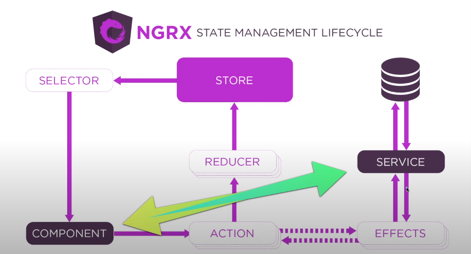

# O que muda na comunicação entre NGRX vs Angular?

- `Angular` com angular você faz a comunicação component -> service e fim.
  - o componente chama a service a service recebe e repassa para o componente.
  - 
- `NGRX` já com NGRX o fluxo é mais completo, você primeiro comunica a sua action, sua action conversa com o reducer que faz o processo para colocar os dados no store o store comunica o selector e o selector comunica o componente.
  - 
