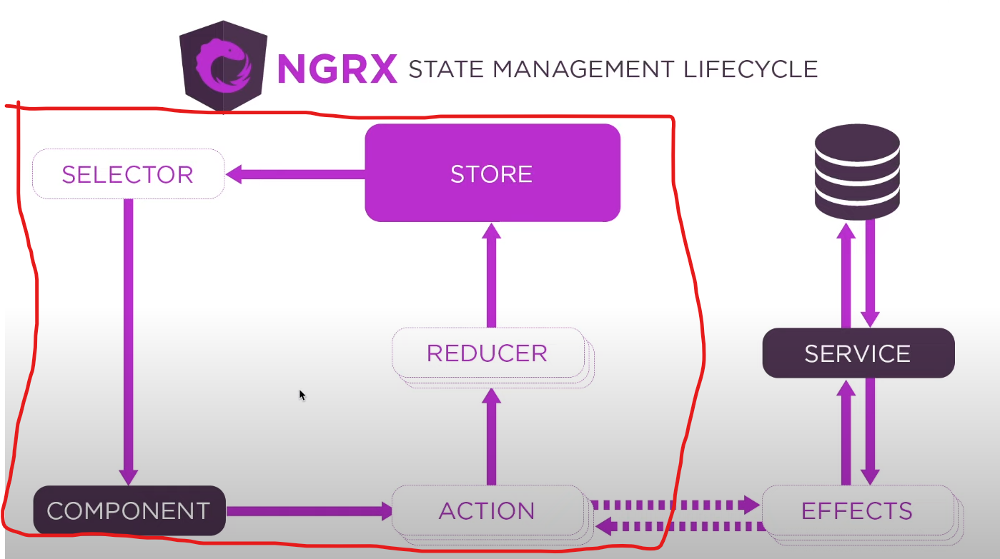

# o NGRX ele é tanto sync como async, depende de como vc utiliza ele

- `FLUXO SINCRONO`: O processo sincrono do NGRX envolve apenas esse bloco da arquitetura
  - 
    - ou seja o componente solicita uma `action` e a action manda para o `reducer` o reducer manda para o `store` e o store comunica a mudança no `selector`
  - todo esse fluxo é `SINCRONO`
- `FLUXO ASINCRONO`: DESCRIÇÃO AQUI..............
  - 
